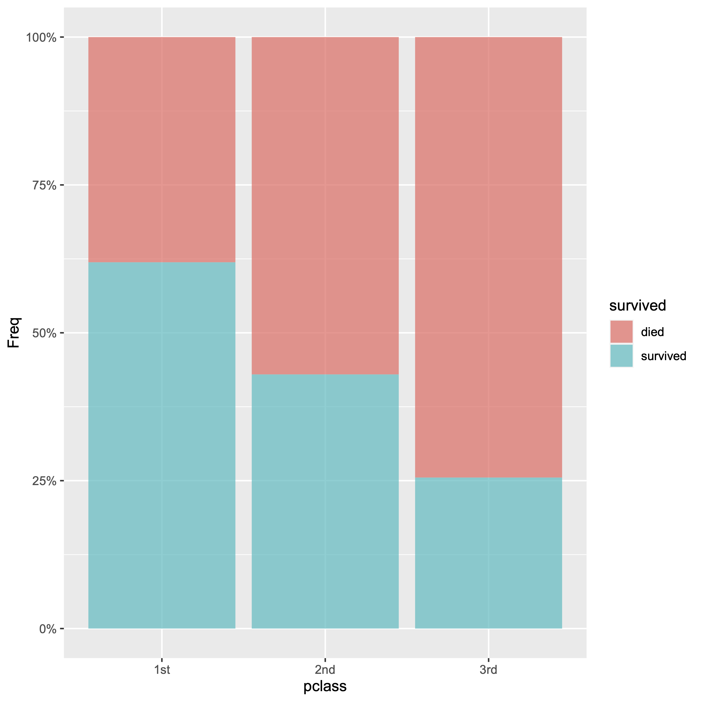

### コラム: Rを使ったグラフの作成

綺麗なグラフィックスを手軽にかつ合理的に描画することをサポートしてくれるggplot2パッケージの関数を利用したRによるグラフの作成について見てみます．

- 棒グラフ



```R
# パッケージ"tidyverse"の読み込み
install.packages("tidyvese")
library("tidyvese")

# パッケージ"scales"の読み込み
install.packages("scales")
library("scales")

# パッケージ"vcdExtra"の読み込み
install.packages("vcdExtra")
library("vcdExtra")

Titanicp %>%																											# Titanicpを対象とする
  select(pclass, survived) %>%																		# 変数を抽出
  table() %>%																											# 分割表の作成	
  as.data.frame() %>%																							# データフレームに変形
  ggplot(aes(x = pclass, y = Freq, fill = survived)) +						# 変数をグラフに結びつける
  geom_bar(stat = "identity", alpha = 0.75, position = "fill") +	# グラフ形式を指定
  scale_y_continuous(labels = percent)														# メモリ軸ラベルを設定
```

2行目〜3行目: ggplot2を含んだパッケージコレクションtidyverseを読み込みます．tidyverseによりggplot2の関数が利用可能となります．

6行目〜7行目: 軸ラベルの設定などを簡便化するのに役立つパッケージscalesを読み込みます．このパッケージにより軸ラベルの数字へ'%'を加えることが簡単に実現しています．

10行目〜11行目: 質的データの利用に供するパッケージvcdExtraを読み込みます．このパッケージにはタイタニック号乗客の生存状況データ'Titanicpが用意されています．

Titanicpは6変数，観測数1309の__データフレーム__です．データフレームとは1列が1変数に対応し，1行が1観測値に対応したデータ形式です．ggplot2でグラフを描画するときはデータフレームを対象とすることが基本です．

13行目: 'Titanicp'をグラフ作成の対象データとします．

14行目: グラフに反映させる変数pclassと変数survivedを抽出します．どちらの変数も質的変数です．pclassは客室(1st, 2nd, 3rd)，survivedは生存（survived, died）についての変数です．

15行目:データフレームを pclassとsurvivedの分割表に変換し，出現回数Freqを計算します.

16行目: 分割表を3変数(pclass, survived, Freq)のデータフレームに戻します．

17行目: グラフのx軸をpclass，y軸をFreqとし，，グループ化をsurvivedで行うことを指定します．

18行目: グラフ形式を棒グラフに指定します．statの値を．．．．．alphaの値でグラフを塗る色の透過度を設定します．positionの値にfillを指定することでグラフが100%積み上げグラフとなります．

19行目: y軸ラベルの数値を100分率に変換し，'%'記号を加えます．


棒グラフ，箱ひげ図，ヒストグラムの


ggoplo2も含むtidyverse

