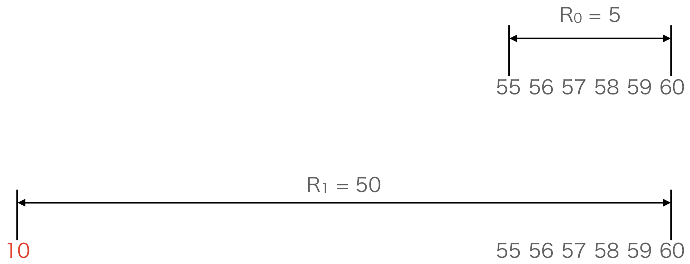
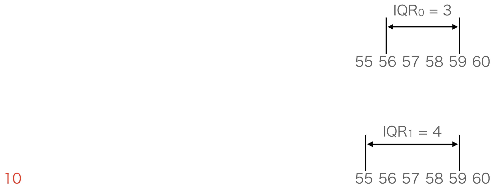
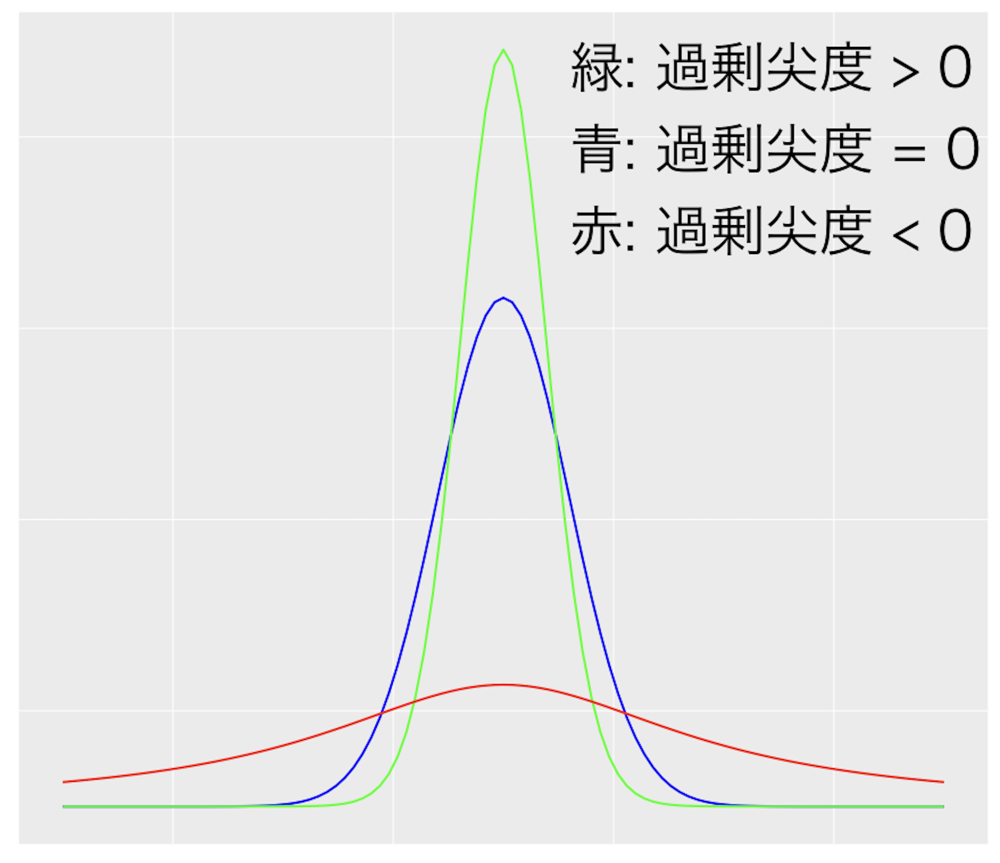
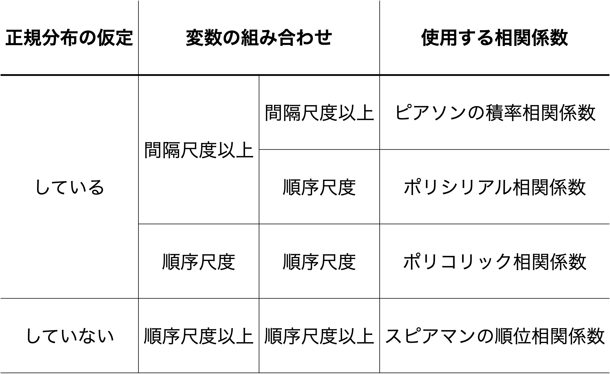
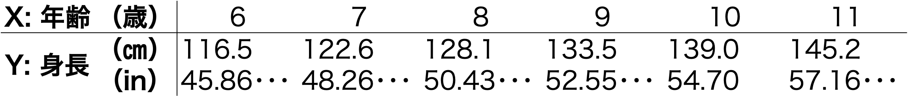
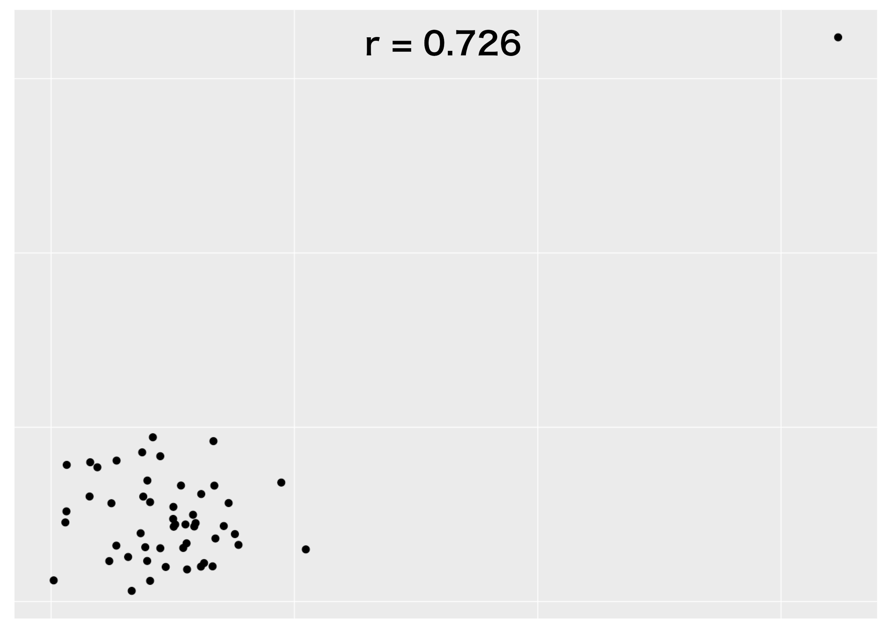
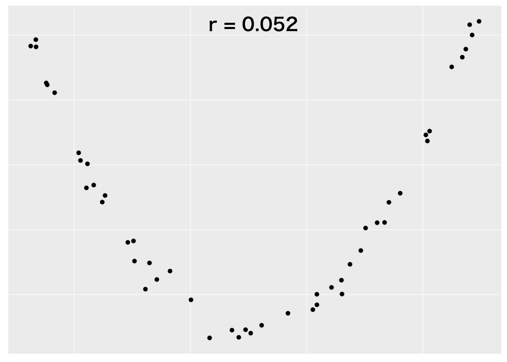
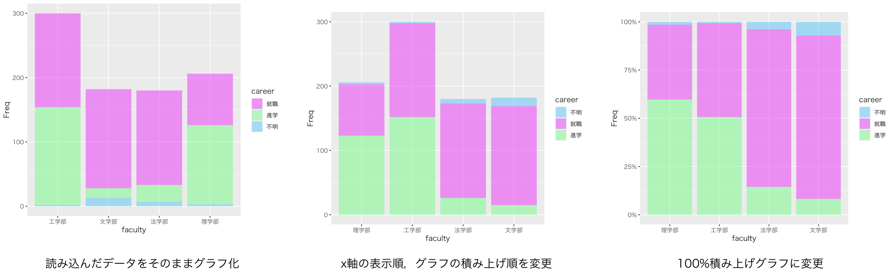

# 1データの記述と可視化
##  2-1. データの記述

データの記述は

### データの整理

データから有益な情報を引き出すためには，まず最初にデータを体系的な方法に則り整理するとが必要となります．整理をしなければデータはただの数字や文字などの羅列であり，そこから傾向や特徴を読み取ることが困難な為です．

例えば，ある企業の社員100名分の部署と年収がペアになったデータのリストがあったとします．部署と年収のペアはランダムに並んでいるようで，眺めているだけではこのデータからはなにもわかりません．しかし，部署毎に年収をまとめ，グラフを描いてみると，部署によって年収が異なっており，開発 > 営業 > 総務の順に高額となっているらしいことが見えてきます．
![データを整理して情報を読み取る]{#fig:1}


このようにデータを整理することが，データから情報を読み取る足がかりとなるのです．

### データの種類

データの整理の仕方はデータの種類によって異なってきます．この節ではデータの種類について見ていきます．

- __質的データ／量的データ__

データは質的データと量的データに大別されます．質的データとは分類を表すデータで，算術計算することはできないデータのことです．一方，量的データとは数値で表されたデータで，算術計算することができるデータのことです．

質的データの例としては学籍番号や氏名，順位などが挙げられます．数字で表されたデータであっても計算結果に意味がないデータであれば，それは質的データとなります．Aさん，Bさん，Cさんの学籍番号がそれぞれ「10010」，「10020」，「20030」であるとき，20030（Cさんの学籍番号） = 10010（Aさんの学籍番号） + 10020（Bさんの学籍番号）となりますが，「CさんはAさんとBさんを足し合わせたような人物」とはなりません．計算結果には意味がありません．よって，学籍番号は数字で表されていますが質的データととなります．

計算はできませんが分類に用いられるため質的データの値はカテゴリーと呼ばれます．いまの例では「10010」，「10020」，「20030」は学籍番号という質的データのカテゴリ−と言うことになります．

量的データの例としては気温や西暦，身長などが挙げられます．量的データは数字により表現され，計算結果には意味が伴います．ある日の札幌市，那覇市の気温がそれぞれ「15℃」，「30℃」であるとき，30℃ - 15℃ = 15℃と引き算することで札幌市と那覇市の気温差は15℃であることがわかります．計算により意味のある結果を得ることができます，よって，気温は量的データとなります．

- __尺度水準__

質的データおよび量的データに大別されたデータは表現する情報の性質を基準にして更に分類することができます．この基準のことを尺度と言います．尺度は一般的に「名義尺度」，「順序尺度」，「間隔尺度」，「比例尺度」の4つの水準に分類され[^foot_note_scale]，質的データは名義尺度のデータと順序尺度のデータに分けられ，量的データは間隔尺度と比例尺度に分けられます．

[^foot_note_scale]: [Stevens, S. S., On the Theory of Scales of Measurement, Science, 103(2684), pp. 677 - 680, 1964]( https://science.sciencemag.org/content/sci/103/2684/677.full.pdf)

__名義尺度__: 名義尺度とはデータの区別だけが可能な尺度です．名義尺度のデータには便宜的に数字を割り振ることができますが，割り振った数字の算術計算には意味がありません．また，大小関係にも意味がありません．しかし，区別はできなければなりませんので等しいか等しくないかには意味があります．

名義尺度のデータの例としては学籍番号を挙げることができます．学籍番号は学生一人一人に数字を割り振った記号として捉えることができます．この学籍番号が等しければ同じ学生を，等しくなければ異なる学生を示していることになります．しかし，先に見たように学籍番号の算術計算には意味がありませんし，Aさんの学籍番号はBさんの学籍番号よりも小さいのでAさんの成績はBさんの成績よりも下位であると言うようなことはありません．大小関係には意味がないのです．よって，学籍番号は名義尺度のデータと言うことになります．

__順序尺度__: 順序尺度とはデータの区別が可能で順序や大小の評価も可能な尺度です．順序尺度のデータは一般的に数字を使って表現されますが，名義尺度と同様，算術計算には意味がありません[^footnote_ordinal]．順序や大小には意味がありますが，順位や大小の差は，その間隔が一定であるとは限らないため意味を持ちません．

[^footnote_ordinal]: データに対して間隔は一定であると言う前提条件を設定することで算術計算に意味を持たせるようにすることもあります．

順序尺度のデータの例として100m走の順位を挙げることができます．ある大会でAさんが1位でBさんは2位，Cさんは3位だったとします．このとき，Bさんは，Aさんより遅くCさんより速い言うことはわかります．しかし，順位の引き算を行い，(3位 - 2位) = (2位 - 1位)なのでAさんとBさんの走力の差はBさんとCさんの走力の差と同じ，とはなりません．Bさんは1位のAさんと僅差の2位だったのかも知れませんし，あるいは3位のCさんと殆ど同タイムの2位だったのかも知れません．順位の算術計算には意味がないことがわかります．よって，順位は順序尺度と言うことになります．
![順位の差は走力の差を反映しているわけではない]{#fig:2}


__間隔尺度__: 間隔尺度とはデータの順序の評価が可能で差や和の評価も可能な水準です．間隔尺度のデータの取り得る数値の間隔は等間隔で，足し算の結果や引き算の結果は意味を持ちます．しかし，0（ゼロ）が「無，何もない」と言う意味ではないため掛け算の結果や割り算の結果は意味を持ちません．

間隔データの例として気温を挙げることができます．ある日の札幌市，那覇市の気温がそれぞれ「15℃」，「30℃」であるとき，30℃ - 15℃ = 15℃と引き算することで札幌市と那覇市の気温差は15℃であることがわかります．引き算により意味のある結果を得ることができます，引き算の逆演算[^foornote_inverse]である足し算の結果も意味を持ちます．しかし，30℃ （那覇市の気温）/ 15℃（札幌市の気温） = 2となるから那覇市の気温は札幌市の気温の2倍である，とはなりません．この割り算を摂氏ではなく華氏[^footnote_Fahrenheit]で行うと86℉ （那覇市の気温）/ 59℉（札幌市の気温） = 約1.5と摂氏による計算とは異なった結果となります．比率は無次元数[^footnote_dimensionless]なので，気温の単位の取り方により結果が異なると言うことは気温の割り算には意味がない[^footnote_subtraction]と言うことです．よって，気温は間隔尺度と言うことになります．
![温度差は等しいが温度"比"は等しくない]{#fig:3}


[^foornote_inverse]: ある演算Fにより$A$が$B$になるとき，$B$を$A$にするような演算$G$のことを$F$の逆演算と言います．
[^footnote_Fahrenheit]: 華氏温度を$F$，摂氏温度を$C$とすると$F = \frac{9}{5} C + 32$となります．
[^footnote_dimensionless]: 単位に依存しない数を無次元数と呼びます．長方形の縦横比（アスペクト比）や比重などが無次元数の例です．
[^footnote_subtraction]: 摂氏を単位とした場合と華氏を単位とした場合では足し算や割り算の結果も数値は異なりますが，足し算や引き算の結果は無次元量ではなく単位を伴った数値であるため，$(那覇市の気温) - (札幌市の気温) = 15℃ (30℃ - 15℃) = 27℉ (86℉ - 59℉)$という等式が成り立ちます．

__比例尺度__: 比例尺度とはデータの比率の評価が可能な水準です．比例尺度のデータでは0（ゼロ）は「無，何もない」ことを意味し，掛け算や割り算の結果も意味を持ちます．
比例尺度の例として身長を挙げることができます．Aさん，Bさんの身長がそれぞれ「150㎝」，「180㎝」であるとき，Bさんの身長はAさんの身長の1.2倍（= 180㎝ / 150㎝）と言うことができます．気温の時とは異なり，身長の単位をセンチメートルからインチに替えて[^7]計算しても70.8661㏌ / 59.0551㏌ = 1.2倍となります．身長は割り算の結果も意味を持つので比例尺度と言うことになります．
![温度差も温度"比"も等しい]{#fig:4}


[^7]: センチメートルで測定した長さをM，インチで測定した長さをFとすると，$F =\frac{M}{2.54}$となります．

以上をまとめた表です．ここで見てきたようにデータに対して意味のある算術計算が尺度の水準によって異なり，データ操作（データに対する数学的操作?）の自由度は「比例尺度」> 「間隔尺度」 > 「順序尺度」 > 「名義尺度」となっています．データ操作（データに対する数学的操作?）の自由度が高い水準はデータ操作（データに対する数学的操作?）の自由度の低い水準の性質を含んでいるので，高い水準のデータは低い水準のデータに変換して扱うことができます．
![データの種類]{#tbl:1}


比例尺度である身長のデータを（0㎝以外のある）基準値，例えば150㎝からの差に変換したデータは間隔尺度のデータとなります[^8]．このデータに対して0㎝以上は「高い」0㎝未満は「低い」と高低を対応付ければ順序尺度になりますす．更に，このデータに対して「高い」は「A」，「低い」は「B」とアルファベットを対応付ければ名義尺度となります[^9]．
![尺度の変換は一方通行．低い尺度への変換は可．高い尺度への変換は不可]{#fig5}


しかし，名義尺度のデータである「A」と「B」を順序尺度の「高い」と「低い」に変換しようとしても「A」と「B」のどちらに「高い」を対応させてどちらに「低い」を対応させるかを決めることができません．「A」に「低い」を対応付けし，「B」に「高い」を対応付けてしまうと元データとは異なるデータとなってしまいます．

このように高い水準のデータは低いデータの水準に変換することができますが，低い水準のデータを高い水準のデータに変換することはできません．

[^8]: 与えられた間隔尺度のデータだけからは基準値が150㎝であるとはわからないので，データ同士の差は身長差として意味を持ちますが，データ同士の比は意味を持ちません．
[^9]: 与えられた名義尺度のデータだけからは高低とアルファベットの対応の仕方がわからないので，身長によるグループ分けでAに属しているのかBに属しているのかはわかりますが，AとBの高低を比較することはできません．

- __離散量／連続量__

数値で表されたデータ（量的データ?）については尺度とは異なる視点から，離散量と連続量に区別されます（することもできます? されることもあります?）．離散量とはサイコロの出目や都道府県の人口など取ることのできる値が飛び飛びとなるデータのことです．一方，連続量とは気温や身長のように取ることのできる値が連続しているデータのことです．

飛び飛びの値を取っていも，そのデータを必ずしも離散量と見做すとは限りません．例えばテストの得点は通常，83点, 76点, 92点, ･･･と言うように整数で表され離散的な値しか取りません．しかし，テストの得点が表している受験者の学力は連続的に変化するものと考えられるので，83点は82.5点〜83.4点に対応する学力を表していると解釈し，テストの得点データは連続量として扱うことが一般的です．

## 要約統計量

データの分布はそのデータの持つ傾向や特徴を探る重要な手がかりとなります．要約統計量はこのデータの分布を概括して表現してくれる数値です．要約統計量からはデータの分布の中心的位置や散らばり具合，形状を知ることができます．よって，与えられたデータの要約統計量を把握することはデータの全体像をイメージするヒントとなります．ただし，データの尺度水準により可能な数学的操作が異なるため適用できる要約統計量もデータの尺度水準に依存します．

### 分布の中心

要約統計量のうちデータの分布の中心的位置を表す統計量には平均値，中央値，最頻値があります．データの分布の中心的位置を表す統計量は__代表値__とも呼ばれます．

- 平均値
多くの場合，平均値と言えば算術平均値（相加平均値）を指しますが，算術平均値ではなく幾何平均値（相乗平均値）や調和平均値などが平均値として扱われる場合もあります．この本でも本節以外では断りがない限り平均値は算術平均値を指すものとしています．

__算術平均値（相加平均値）__: 要素数が_n_個のデータ($a_1$, ･･･, $ a_n$)の算術平均値_A_は以下の式で求められます．
$$
\mathbf{\textit{A}} = \frac{a_1 + a2 + ･･･　＋ a_n}{n} = \frac{1}{n} \sum_{i = 1}^n a_i
$$

算術平均値はデータの要素すべてを足し合わせた値をデータの要素数で割った値です．足し算を行うので間隔尺度以上のデータに対して意味を持ちます．

算術平均値は数学や物理学，工学などの理系分野だけではなく言語学や経済学，社会学などの文系分野でも広く利用されています．

__幾何平均値（相乗平均値）__: 要素数が_n_個のデータ{$$a_{1}, ･･･, a_{n}$$}の幾何平均値_G_は以下の式で求められます．

$$
\mathbf{\textit{G}} = \sqrt[n]{a_1 \times a2 \times ･･･　\times a_n} = \left( \prod_{i = 1}^n a_i \right)^\frac{1}{n}
$$

幾何平均値はデータの要素すべてを掛け合わせた値のn乗根[^10]です．掛け算を行うので比例尺度以上のデータに対して意味を持ちます．また，データはすべて正の数である必要があります．

幾何平均値はデータの要素同士の掛け算が有益な（有意義な?）データの代表値として採用されます．応用例として比率の平均値を挙げることができます．

日本の移動通信の2011年から2020年の各年3月の月間平均アップロードトラフィックの推移は(9.9Gbps, 23.4Gbps, 44.2Gbps, 80.0GBps, 123.3Gbps, 184.5, 249.0, 335.9, 404.6, 442.3Gbps)となっています[^11]．よって，月間平均アップロードトラフィックの前年度比は(2.36, 1.89, 1.81, 1.54, 1.50, 1.35, 1.35, 1.20, 1.09)となります．前年度比の算術平均値を_A_，幾何平均値を_G_とすると
$$
A = \frac{2.36 + 1.89 + 1.81 + 1.54 + 1.50 + 1.35 + 1.35 + 1.20 + 1.09}{9} = 1.565･･･
$$
$$
G = \sqrt[9]{2.36 \times 1.89 \times 1.81 \times 1.54 \times 1.50 \times 1.35 \times 1.35 \times 1.20 \times 1.09} = 1.524･･･
$$
となります．

「2011年から2020年までの前年度比の平均値は_M_である」とすれば，2011年から2020年までは毎年_M_の比率で月間平均アップロードトラフィックが増加または減少しているとして2011年の月間平均アップロードトラフィックの値$T_{2011}$から2020年の値$T_{2020}$を計算することができます．この時，_M_，$T_{2011}$，$T_{2020}$には以下の関係が成立します．
$$
T_{2020} = T_{2011} \times M^{(2020 - 2011)} = T_{2011} \times M^{9}
$$
2011年の月間平均アップロードトラフィックの実測値9.9を$T_{2011}$に代入し，_M_ = _A_および_M_ = _G_としてそれぞれ$T_{2020}$を計算すると，
$$
T_{2020} = 9.9 \times A^9 = 9.9 \times 1.565^9 = 557.5･･･ \\
T_{2020} = 9.9 \times G^9 = 9.9 \times 1.524^9 = 439.0･･･
$$
となります．

2020年の月間平均アップロードトラフィックの実測値は442.3なので算術平均値を前年度比の平均値としてしまうと2020年の値を大きく見積もりすぎてしまいます．この場合の平均値は幾何平均値が妥当であることがわかります[^12]．

[^10]: xのn乗がyになるとき，xをｙのn乗根と言います
[^11]: [我が国の移動通信トラヒックの現状](https://www.soumu.go.jp/johotsusintokei/field/data/gt010602.xlsx)

[^12]: 元データの値442.3Gbpsと一致していない理由は前年度比の数値やGの値を丸めて計算しているためです．数値を丸めずに計算すれば元データの値と一致します．

__調和平均値__: 要素数が_n_個のデータ{$$a_{1}, ･･･, a_{n}$$}の調和平均値_H_は以下の式で求められます．
$$
\mathbf{\textit{H}} = \frac{n}{\frac{1}{a_1} + \frac{1}{a_2} + ･･･ + \frac{1}{a_n}} = \frac{n}{\sum_{i = 1}^n \frac{1}{x_i}}
$$
調和平均値はデータ要素の逆数の算術平均値の逆数です，データ要素の逆数を利用するので比例尺度以上のデータに対して意味を持ちます．また，データはすべて正の数である必要があります．

調和平均値は幾何平均値と同様，比率の平均値として採用されます．応用例として速度の平均値を挙げることができます．

東京ー福岡900㎞を最初の300㎞は時速60㎞ / hで，次の300㎞は時速120㎞ / hで，最後の300㎞は時速150㎞ / hで移動したとします．300㎞ずつを時速60㎞ / h，時速120㎞ / h，時速150㎞ / hで移動するので東京から福岡までの移動時間を_T_とすると
$$
T = \frac{300}{60} + \frac{300}{120} + \frac{300}{150} = 9.5
$$
となります．また，移動速度の算術平均値を_A_，調和平均値を_H_とすると
$$
A = \frac{60 + 120 + 150}{3} = 110 \\
H = \frac{3}{\frac{1}{60} + \frac{1}{120} + \frac{1}{150}} = 94.73･･･
$$
となります．

「東京から福岡までの移動速度の平均値は_M_である」とすれば，東京から福岡までは速度_M_で移動し続けたとして東京から福岡までの移動時間_T_を計算することができます．この時，_M_ ，_T_には以下の関係が成立します．
$$
T = \frac{900}{M}
$$
$M = A$および$M = H$としてそれぞれ_T_を計算すると
$$
T = \frac{900}{A} = \frac{900}{110} = 8.18･･･ \\
T = \frac{900}{H} = \frac{900}{94.73･･･} = 9.5
$$
となります．東京から福岡までの移動時間は9.5時間なので算術平均値を速度の平均値としてしまうと誤った数値を導いてしまいます．この場合の平均値は調和平均値が妥当であることがわかります．

算術平均値，幾何平均値，調和平均値のいずれの計算にもすべてのデータが使われます．これは平均値にはすべてのデータが影響を及ぼしていると言うことであり，分布の全体像を概括するという要約統計量として優れている点だと言えます．

一方で，すべてのデータを利用しているが為に，データに他の値とは大きく異なる値である外れ値が含まれていると，平均値はその影響を大きく受けます．

外れ値の影響を確かめてみます．データ$X_0 = (55, 56, 57, 58, 59, 60)$の算術平均値_A_，幾何平均値_G_，調和平均値_H_は以下の様になります．
$$
A = 57.5, G = 57.47･･･, H = 57.44･･･
$$
データ$X_0$に外れ値として10が含まれたデータ$X_1 = (10, 55, 56, 57, 58, 59, 60)$の_A_，_G_，_H_は以下の様になります．
$$
A = 50.71･･･, G = 44.76･･･, H = 34.23･･･
$$
外れ値が1つ含まれただけでデータ$X_1$の3種類の平均値はいずれもデータ$X_0$の区間（範囲？）[55, 60]には含まれない値となっています．これは平均値が外れ値に対して頑健ではないことを示しています．

また，平均的とは「その同類全体の中で最も一般的であるさま．普通程度であるさま．」[^13]を意味しますが，データの分布に偏りがあると平均値は平均的な値とはなりません．


左の図は「平成28年 国民生活基礎調査の概況」（厚生労働省）[^14]に掲載されている各種世帯の貯蓄額階級別世帯数の割合の表をベースに仮想的に作成した貯蓄額毎の世帯数の分布をグラフにしたものです．データの分布に偏りがあります．このデータから計算される貯蓄額の平均値[^15]は1,069万円となりますが，この貯蓄額が平均的であると言うことには無理がありそうです．

右の図は左右対称になるように作成した貯蓄額毎の世帯数の分布をグラフにしたものです．このデータから計算される平均値は3,322万円となります．偏りがある分布とは異なり，単峰性[^16]で偏りのない分布では平均値が平均的な値であることがわかります．

[^13]: [三省堂大辞林第三版](https://www.weblio.jp/content/平均的)
[^14]: [「平成28年 国民生活基礎調査の概況」（厚生労働省）](https://www.mhlw.go.jp/toukei/saikin/hw/k-tyosa/k-tyosa16/dl/16.pdf)
[^15]: ここでの平均値は算術平均値です．貯蓄額が0の世帯もデータに含まれるため幾何平均値や調和平均値は計算できません．
[^16]: 単峰性の分布とはピークが1つの分布のことです．

ここで見たように，外れ値が含まれるデータや分布に偏りのあるデータの平均値は代表値としては適切ではない場合があるので注意が必要です．

- 中央値

中央値とはデータを昇順あるいは降順に並べた時，中央になる値です．データの要素数が無限の場合，中央値は存在しません．

データの要素数を_N_，データを昇順に並べた時の_i_番目の要素を$a_{i}$とすると中央値_Med_は以下の式で求められます．
$$
Med = \left\{
				\begin{array}{}
					a_{\frac{N + 1}{2}} （N: 奇数） \\
					\frac{a_{\frac{N}{2}} + a_{\frac{N}{2} + 1}}{2} （N: 偶数）
				\end{array}
			\right.
$$
データの要素数が奇数の時はデータを昇順に並べた時の中央の要素の値，データの要素数が偶数の場合はデータを昇順に並べた時の中央に近い2つの要素の値の算術平均値となります．データを昇順に並べるためデータの要素間で大小の評価が必要となります．よって，中央値は順序尺度以上のデータに対して意味を持ちます．

上の中央値を求める式からも判るように，中央値（の値?）は中央の1つの要素あるいは中央に近い2つの要素のみから影響を受けます．そのため平均値に比べ中央値は外れ値の影響を受けにくい代表値となっています．

先に平均値における外れ値の影響を確かめた際に使ったデータ$X_{0}$とデータ$X_{1}$についてそれぞれの中央値を$Med_{0}$，$Med_{1}$とすると
$$
Med_{0} = \frac{57 + 58}{2} = 57.5 \\
Med_{1} = 57
$$
となります．中央値は平均値と比べ外れ値の影響が少なく，外れ値に対して頑強であることが判ります．

一方で，1つあるいは2つの要素の値という限られた値のみを利用しているため，データ全体の変化を中央値では捉えられないこともあります．

ある企業の部署毎の売り上げを昇順にしたデータが前年度は(10億円, 15億円, 30億円, 35億円, 40億円)で今年度は(15億円, 20億円, 25億円, 45億円, 50億円)だったとします．前年度の売上総額を$S_{0}$，算術平均値を$A_{0}$，中央値を$Med_{0}$，今年度の売上総額を$S_{1}$，算術平均値を$A_{1}$，中央値を$Med_{1}$とすると，
$$
S_{0} = 130, A_{0} = 26, Med_{0} = 30 \\
S_{1} = 155, A_{1} = 31, Med_{1} = 25
$$
となります．前年度に比べ今年度の売上総額および算術平均値は増えていますが[^17]，中央値だけは減っています．中央値の変化だけを見ていると前年度に比べ今年度の売り上げが約1.2倍に伸びたことに気づかないだけではなく，逆に業績が悪化したと判断してしまいかねません．

データのうち1つまたは2つの要素の値しか反映しないという中央値の特徴が弱みとなった例です．

[^17]: 幾何平均値も調和平均値も前年度に比べ今年度の値は大きくなります．

- 最頻値

最頻値とはデータの中で出現する回数が最も多い値です．値同士の区別ができればその値の出現回数を数えることができるので，最頻値を求めるために算術計算や大小評価をする必要はありません．従って，最頻値はすべての尺度水準のデータに対して意味を持ちます．

最頻値は名義尺度のデータに対しては唯一の有効な代表値となります．日本国内に住民票のある居住者全員の住所の都道府県名のデータは(北海道 , 東京, 東京, 大阪, ･･･)と言うようになります．このデータは名義尺度であるため算術計算をすることができず平均値を求めることができません．また，大小の評価をすることもできないので中央値を求めることもできません．しかし，「北海道と東京は別の値である」と区別をすることはできるためデータの中で最も出現回数の多い値が「東京」であると決定することができ，最頻値は求めることができます．

最頻値は最も出現回数の多い値だけに依存して決定されます．また，外れ値の出現回数が他の値の出現回数よりも多く，外れ値が最頻値となることは非常に特殊なケースを除いてはありません[^18]．従って，最頻値は殆どの場合，外れ値の影響は受けず，外れ値に対して頑強であると言えます．

[^18]: データの要素数が極端に少ない場合には外れ値が最も多く出現するケースも皆無ではありません．

また，先に平均値におけるデータの分布の偏りの影響を確かめた貯蓄額毎の世帯数分布のように極端に分布に偏りのあるデータに対しては，最頻値が代表値として妥当である場合があります．

最頻値は一意に定まるとは限りません．ある政党に対する支持を問うたアンケートに対する120名の回答が以下の様だったとします．この場合，最頻値は「強く支持する」と「どちらとも言えない」の2つとなっています．

1つのデータに対して平均値や中央値が2つ以上存在すると言うことはありませんが，最頻値はこのように2つ以上存在することもあります．このことは最頻値の代表値としてのデメリットと言えます．


また，このアンケート結果から政党を支持しているのかあるいは支持していないのかをはっきりさせるため，「強く支持する」の回答数と「支持する」の回答数をまとめ，新たに「支持する」の回答数とし，「まったく支持しない」の回答数と「支持しない」の回答数をまとめ，新たに「支持しない」の回答数として結果をまとめ直すと以下の様になります．


まとめ直したアンケート結果の最頻値は「支持しない」となり，元のアンケート結果とは異なる印象を与えます．最頻値はデータの区切り方（度数分布の階級幅?）に大きく影響を受けることがわかります．このことも最頻値の代表値としてのデメリットと言えます．

適用可能な代表値と尺度水準の対応は以下の様になります．


平均値はデータが有している情報をすべて反映していますが，中央値や最頻値はデータが有している情報を切り捨てています．データが有している情報を反映している程度は平均値 > 中央値 > 最頻値​となっています．従って，原則的には代表値としては平均値を使うことが好ましいと言えます．

しかし，対象とするデータの尺度水準に適用可能な代表値でなければ，その代表値は意味を持ちません．また，ここで述べたように平均値，中央値，最頻値にはそれぞれメリット，デメリットがあります．データに対して代表値使う時には，これらを踏まえて使用することが重要です．

### 分布の散らばり

要約統計量のうちデータの分布の散らばり具合を表す統計量には分散，標準偏差，範囲，四分位範囲などがあります．データの分布の散らばり具合を表すこれらの統計量は__散布度__とも呼ばれます．

- 分散

分散とはデータの分布が平均値に集中している程度により散らばり具合を指標化した数値です．具体的には__偏差__の二乗の平均値として定義されます．偏差とは平均値と要素の差のことです．

データ$(x_{1}, x_{2}, ･･･, x_{n})$の平均値を$\bar{x}$とすれば，$x_{i}$の偏差$D_{i}$は以下の式で求められます．
$$
D_{i} = x_{i} - \bar{x}
$$
偏差の絶対値が大きければそのデータ要素は平均値から離れていることになります．しかし，偏差の定義より全データ要素の偏差の総和は0となってしまいますので，偏差そのものではなく偏差を二乗します，偏差を二乗した値もそのデータ要素が平均値から離れているほど大きな値となります．この偏差の二乗の平均値として分散を定義します．

よって，それぞれのデータ要素が平均値から離れているほど分散は大きくなります．従って，分散は平均値への集中度合いを表す散布度となります．


要素数が_n_個のデータ($x_1$, ･･･, $ x_n$)からなる母集団の算術平均値を$\mu$とすると，この母集団の分散である$\sigma^2$は以下の式で求められます．
$$
\sigma^2 = \frac{1}{n} \sum_{i = 1}^n (x_i - \mu)^2
$$
要素数が_n_個のデータ($x_1$, ･･･, $ x_n$)からなる標本の算術平均値を$\bar{x}$とすると，この標本の分散である__標本分散__$s^2$は以下の式で求められます．
$$
s^2 = \frac{1}{n} \sum_{i = 1}^n (x_i - \bar{x})^2
$$
多くの場合，データ分析では母集団の性質を知ることが目的となりまが，母集団のデータをすべて入手できることは殆どありません．そのため，母分散$\sigma^2$も直接計算することはできません．しかし，標本から母分散$\sigma^2$を推定することができます．

この標本に基づき推定される母分散$\sigma^2$の推定量は__不偏分散__と呼ばれ，一般的に標本分散$s^2$よりも若干小さな値になることが知られています．

要素数が_n_個のデータ($x_1$, ･･･, $ x_n$)からなる標本の算術平均値を$\bar{x}$とすると，不偏分散$\hat{\sigma}^2$は以下の式で求められます[^19]．
$$
\hat{\sigma}^2 = \frac{1}{n - 1} \sum_{i = 1}^n (x_i - \bar{x})^2
$$
標本分散$s^2$と不偏分散$\hat{\sigma}^2$の計算式から判るように，データのサンプルサイズ_n_が大きいほど，標本分散$s^2$は不偏分散$\hat{\sigma}^2$に近づきます．

あるクラスを対象に数学のテストを実施し，全受験者の中からランダムに選んだ5名の点数が(60, 65, 70, 80, 90)だったとします．この5名の点数の算術平均値を$\bar{x}$，標本分散を$s^2$，今回のテストの点数の不偏分散$\hat{\sigma}^2$とすれば
$$
\bar{x} = \frac{60 + 65 + 70 + 80 + 90}{5} =  73 \\
s^2 = \frac{1}{5} \left \{ (60 - 73)^2 + (65 - 73)^2 + (70 - 73)^2 + (80 - 73)^2 + (90 - 73)^2\right \} = 116\\
\hat{\sigma}^2 = \frac{1}{5 - 1} \left \{ (60 - 73)^2 + (65 - 73)^2 + (70 - 73)^2 + (80 - 73)^2 + (90 - 73)^2\right \} = 145
$$
となります．

また，標本に基づき推定される推定量の期待値が母集団のそれに等しい時，この推定量は不偏推定量と呼ばれますが，不偏分散の期待値は母分散に一致するので分散の不偏推定量となっています．即ち，母集団から標本抽出を_k_回行い，_i_回目の標本から計算される不偏分散を$\hat{\sigma}^2_i$とすると，
$$
\sigma^2 = \lim_{k \to \infty}(\frac{1}{k}\sum_{i = 1}^k \hat{\sigma}^2_{i})
$$
となります[^20]．

[^19]:不偏分散の計算式の妥当性は数学的に導くことができます．参考文献
[^20]: 不偏分散の期待値が母分散と一致することも数学的に導かれます．

データ分析では母分散や標本分散よりも頻繁に不偏分散を扱います，このためデータ分析において分散とは一般的に不偏分散を意味します．

- 標準偏差

標準偏差とは分散の正の平方根として計算される散布度です．データが母集団の時の標準偏差を__母標準偏差__，データが標本の時の標準偏差を__標本標準偏差__呼びます．

要素数が_n_個のデータ($x_1$, ･･･, $ x_n$)からなる母集団の算術平均値を$\mu$とすると，この母集団の母標準偏差$\sigma$は以下の式で求められます．
$$
\sigma = \sqrt{\sigma^2} = \sqrt{\frac{1}{n} \sum_{i = 1}^n (x_i - \mu)^2}
$$

要素数が_n_個のデータ($x_1$, ･･･, $ x_n$)からなる標本の算術平均値を$\bar{x}$とすると，この標本の標本標準偏差$s$は以下の式で求められます．
$$
s = \sqrt{s^2} = \sqrt{\frac{1}{n} \sum_{i = 1}^n (x_i - \bar{x})^2}
$$

母分散の不偏推定量である不偏分散$\hat{\sigma}^2$の平方根である$\hat{\sigma}$を不偏標準偏差と呼びます（呼ぶことがあります？）．$\hat{\sigma}$の期待値は母集団の標準偏差と等しいとは限らず，$\sigma$は母集団の標準偏差の不偏推定量ではありませんが，母集団の標準偏差の推定量として利用されます．
$$
\hat{\sigma} = \sqrt{\hat{\sigma}^2} = \sqrt{\frac{1}{n - 1} \sum_{i = 1}^n (x_i - \bar{x})^2}
$$
分散も標準偏差も平均値を基準にしたデータ分布の散らばり具合を表していますが，分散は平均値と単位が異なります．他方，標準偏差は平均値と単位が同じになります．例えば，㎝を単位として測定したデータの平均値と標準偏差の単位は㎝ですが，分散の単位は$cm^2$となります．

このため平均値と標準偏差は直接比較することができますが，平均値と分散を直接比較することは自然ではありません．データ分布を代表値と散布度で記述する場合も代表値が平均値の時は，散布度として分散でなく，標準偏差を採用することが一般的です．

- レンジ

レンジとはデータの存在している範囲によりデータの散らばり具合を指標化した数値です．データの要素の最大値が$x_{max}$，最小値が$x_{min}$である時，このデータのレンジ$R$は以下の式で求められます．
$$
R = x_{max} - x_{min}
$$
データに外れ値が含まれている場合，レンジは外れ値の影響を受けます．

データに外れ値が含まれていれば，（非常に特殊な場合を除き？）データの要素の最大値あるいは最小値のうち少なくともどちらかは外れ値です．よって，レンジは外れ値の影響を直接受けます．

先に平均値における外れ値の影響を確かめた際に使ったデータ$X_{0}$とデータ$X_{1}$についてそれぞれのレンジを$R_{0}$，$R_{1}$とすると
$$
R_{0} = 60 - 55 = 5 \\
R_{1} = 60 - 10 = 50
$$
となります．レンジが外れ値の影響を受けることが確認できます．



レンジはデータの要素の最大値と最小値の2つの値により決定され，この2つの値以外からは一切影響を受けません．よって，サンプルサイズが変化してもレンジに対する外れ値の影響は変化しません．一方，データのサンプルサイズが計算式に含まれる分散や標準偏差はサンプルサイズが大きくなると外れ値の影響は小さくなります．

このため，レンジは分散や標準偏差よりも外れ値に対して敏感です．

- 四分位範囲

四分位範囲とはレンジと同様，データの存在している範囲によりデータの散らばり具合を指標化した数値です．レンジは全データの存在する範囲として最大値と最小値から求められますが，四分位範囲はデータの中央部の約50%が存在する範囲として四分位数を使って求められます．

四分位数とはデータを昇順に並べ4等分にした時，その4等分した位置にある値のことです．小さい方から第1四分位数，第2四分位数，第3四分位数と言います．第2四分位数は中央値と等しくなります．

第1四分位数を$Q_{1}$，第3四分位数を$Q_{3}$とすると四分位範囲$IQR$は以下の式で求められます．
$$
IQR = Q_{3} - Q_{1}
$$
データに外れ値が含まれていれば，外れ値は（非常に特殊な場合を除き？）最小値から第1四分位数の間または第3四分位数から最大値の間に存在しています．しかし，（レンジは最大値と最小値を使って求められましたが，？）四分位範囲は最小値から第1四分位数までのデータと第3四分位数から最大値までのデータを切り捨てて求められます．従って，四分位範囲は外れ値に対して頑強です．

先に平均値における外れ値の影響を確かめた際に使ったデータ$X_{0}$とデータ$X_{1}$についてそれぞれの第1四分位数を$Q_{1\_0}$，$Q_{1\_1}$，第3四分位数を$Q_{3\_0}$，$Q_{3\_1}$，四分位範囲を$IQR_{0}$，$IQR_{1}$とすると
$$
Q_{1\_0} = 56, Q_{3\_0} = 59 \\
IQR_{0} = Q_{3\_0} - Q_{1\_0} = 59 - 56 = 3 \\
Q_{1\_1} = 55, Q_{3\_1} = 59 \\
IQR_{1} = Q_{3\_1} - Q_{1\_1} = 59 - 55 = 4
$$
となります．四分位範囲がレンジとは異なり，外れ値に対して頑強であることが確認できます．



データ分布を代表値と散布度で記述する場合に代表値を中央値とした時は散布度として標準偏差ではなく四分位範囲を採用することが一般的です．標準偏差は平均値に対してのデータの散らばりを指標化した散布度なので，中央値とペアで使うことが不自然なためです．

四分位数の具体的な求め方については複数の手法が提唱されいますが[^21]，どの手法が最も優れているかについては合意が形成されていません．以下では中央値を利用した四分位数の求め方について説明します．

1. データを昇順に並べ中央値を求めます．この中央値が第2四分位数$Q_{2}$となります．
2. データを$Q_{2}$より小さい部分と大きい部分に分けます．
3. 小さい部分の中央値を第1四分位数$Q_{1}$，大きい部分の中央値を第3四分位数$Q_{3}$とします．

先程の四分位範囲における外れ値の影響を確かめた例ではこの手法で第1四分位数および第3四分位数を求めています．

[^21]: [Quartile](https://en.wikipedia.org/wiki/Quartile)

散布度は間隔尺度以上のデータに対して意味を持ちます．

### 分布の形状

要約統計量のうちデータの分布の形状を表す統計量には歪度，尖度があります．

- 歪度

歪度とは分布の歪み具合を指標化した統計量です．要素数が_n_個のデータ($x_1$, ･･･, $ x_n$)からなる標本の算術平均値を$\bar{x}$，不偏標準偏差を$\hat{\sigma}$とすると，母集団の歪度の推定量$b_{1}$は以下の式で求められます．ただし，$b_{1}$は不偏推定量ではありません．
$$
b_{1} = \frac{m_{3}}{\hat{\sigma}^3} \\
ただし，m_{3} = \frac{1}{n} \sum_{i = 1}^n \left (x_{i} - \bar{x}\right)^3 とする
$$

歪度が正となる時，分布は右に裾の長い形状となります．歪度が負となる時，分布は左に裾の長い形状となります．


- 尖度

尖度とは分布の裾の重さを指標化した統計量です．要素数が_n_個のデータ($x_1$, ･･･, $ x_n$)からなる標本の算術平均値を$\bar{x}$，不偏標準偏差を$\hat{\sigma}$とすると，母集団の尖度の推定量$b_{2}$は以下の式で求められます．ただし，$b_{2}$は不偏推定量ではありません．
$$
b_{2} = \frac{m_{4}}{\hat{\sigma}^4} \\
ただし，m_{4} = \frac{1}{n} \sum_{i = 1}^n \left (x_{i} - \bar{x}\right)^4 とする
$$
尖度$b_{2}$はデータ分布が正規分布[^22]に従う時，$b_2 = 3$となるので，正規分布を基準とした評価を行いたい時には以下の式で与えられる$g_{2}$​を尖度として使います．$g_{2}$は過剰尖度と呼ばれます．
$$
g_{2} = b_{2} - 3
$$
過剰尖度が正となる時，分布の裾は正規分布の裾よりも軽くなります．過剰尖度が負となる時，分布の裾は正規分布の裾よりも軽くなります．分布が正規分布に従う時は過剰尖度は0になります．



上図では青色の曲線が正規分布です．過剰尖度を調べることで極端な値を取るデータの割合が，正規分布と比べて大きいかを判断することができます．

歪度および尖度は間隔尺度以上のデータに対して意味を持ちます．

[^22]: 正規分布は社会科学分野でも自然科学分野でも頻繁に用いられる確率分布です．詳細は◯章◯節参照．

## 関係を捉える

変数間の関係を調べることは，データ分析の大きな目的です． 変数間の関係の表現方法は，その変数がどの尺度水準なのかによって変わってきます．

### 分割表

分割表とは，質的変数[^footnote_ qualitative_V]間の関係を分析する際に，その前段階として作成される変数間の関係を集計した表のことです．$n$個の変数を対象とすれば$n$次元の分割表が作成されます．

[^footnote_ qualitative_V]: 名義尺度の変数および順序尺度の変数．

3次元以上は紙面（平面?）での表現が困難なため，ここでは2つの変数を対象とした2次元分割表について説明します．

関心のある2つの変数のうち，一方の変数の実現値を行名，もう一方の変数の実現値を列名にします．行に対応させた変数$A$の実現値が$(A_1, A_2, ･･･, A_r)$の$r$種類，列に対応させた変数$B$の実現値が$(B_1, B_2, ･･･, B_s)$の$s$種類ならば分割表は以下の様に$(r + 1)$行$ \times (s + 1)$列なります．この表は$r \times s$分割表と呼ばれます．

$i$行$j$列のセルには，変数$A$の実現値が$A_i$で変数$B$の実現値が$B_j$となっているサンプルの出現回数を記入します．最下行には各列の合計値を，最右行には各行の合計値を記入します．表の右下に記入される数値はデータのサンプルサイズとなっています．


仮に想定したある大学の今年度の学部卒業生のデータを例にして．分割表の作成の仕方を見てみます．


このデータから卒業学部と進路を変数とした分割表は以下の手順で作成します．

1. データ中に現れる学部の実現値と進路の実現値を抽出します．今回は学部の実現値が(理学部, 工学部, 経済学部, 文学部)の4種類​，​進路の実現値が(進学, 就職, 不明)の3種類たったとします．
2. $5 \times 4$の表を作成し行名を「理学部」，「工学部」，「経済学部」，「文学部」，列名を「進学」，「就職」，「不明」とします．
3. 行名と列名のクロスしたセルには，データからその行名と列名の組み合わせに該当する卒業者をカウントし，その数を記入します．学部が理学部で進路が就職となっているデータ（サンプル?）が80件であれば，セル［理学部 - 就職］には80と記入します．
4. 最下行には列ごとの合計値を，最右行には行ごとの合計値を記入します．


手作業での分割表の作成はかなり大変な作業となりますが，RやPythonであれば1つの関数（コマンド?）で作成することもできます．

この分割表から理系学部における進学の割合と文系学部における進学の割合には差がありそうだと言うことがわかりますが，実際に学部の違いが進学の割合に影響を与えているかを客観的に判断するためには検定をする必要があります[^23]．

[^23]: $\chi^2$検定（カイ二乗検定）など．◯章◯節

分割表はずべての尺度水準のデータに対して適用することができますが，間隔尺度以上のデータである量的変数に対して分割表を利用することは一般的には行われません．分割表を作成するためにはデータを質的変数に変換する必要があり，そのことにより量的変数としての情報を損なうことになるからです．

### 相関係数

相関係数とは2つの変数間の比例的性質の強さを指標化した数値です．相関係数は-1以上1以下の値を取り，その絶対値が小さければ変数間の比例的性質が弱いことを，その絶対値が大きければ比例的性質が強いことを示します．

相関係数には幾つかの種類があり，対象とする変数の尺度の組み合わせや仮定される変数の分布によって使い分けられます．



ここではピアソンの積率相関係数について説明します．一般的に相関係数という場合は，このピアソンの積率相関係数を指します．

変数$X(x_{1}, x_{2}, ･･･, x_{n})$と変数$Y(y_{1}, y_{2}, ･･･, y_{n})$がペアになったデータ$\{(x_{1}, y_{1}), (x_{2}, y_{2}), ･･･, (x_{n}, y_{n}) \}$のピアソンの積率相関係数$r$は，変数$X$の平均値を$\bar{x}$，$Y$の平均値を$\bar{y}$とすると以下の式で求められます．
$$
r = \frac{\sum_{i = 1}^n (x_{i} - \bar{x})(y_{i} - \bar{y})}{\sqrt{\sum_{i = 1}^n (x_{i} - \bar{x})^2}\sqrt{\sum_{i = 1}^n (y_{i} - \bar{y})^2}}
$$
なぜ，この式で求められる数値が比例的性質の強さの指標になるのかについて見てみます．

この式の分子と分母，それぞれに$\frac{1}{n}$を掛けると
$$
r = \frac{\frac{1}{n} \sum_{i = 1}^n (x_{i} - \bar{x})(y_{i} - \bar{y})}{\sqrt{\frac{1}{n} \sum_{i = 1}^n (x_{i} - \bar{x})^2}\sqrt{\frac{1}{n} \sum_{i = 1}^n (y_{i} - \bar{y})^2}}
$$

と変形できます．

変数$X$の標準偏差を$s_{x}$，$x_{i}$の偏差を$D_{x\_i}$，変数$Y$の標準偏差を$s_{y}$，$y_{i}$の偏差を$D_{y\_i}$とすれば，
$$
r = \frac{\frac{1}{n} \sum_{i = 1}^n D_{x\_i}D_{y\_i}}{s_{x} s_{y}} 
$$
となります．

この式の分子は変数$X$の偏差と変数$Y$の偏差の掛け算の平均となっています．この平均のことを共分散と呼びます．

いま，変数$X$と変数$Y$の共分散を$s_{xy}$とすると，
$$
s_{xy} = \frac{1}{n} \sum_{i = 1}^n D_{x\_i}D_{y\_i} \\
r = \frac{s_{xy}}{s_{x} s_{y}}
$$
です．

$D_{x\_i}$と$D_{y\_i}$が同符号となる$(x_{i}, y_{i})$のペアでは$D_{x\_i} D_{y\_i} > 0$となります．一方，$D_{x\_i}$と$D_{y\_i}$の符号が異なる$(x_{i}, y_{i})$のペアでは$D_{x\_i} D_{y\_i} < 0$となります．


図からわかるように，$D_{x\_i} D_{y\_i} > 0$となるような点$(x_{i}, y_{i})$は平均$(\bar{x}, \bar{y})$に対して右上がりの直線上にあります．$D_{x\_i} D_{y\_i} < 0$となるような点$(x_{i}, y_{i})$は平均$(\bar{x}, \bar{y})$に対して右下がりの直線上にあります．よって，平均に対して右上がりの直線上にある点が多くなるようなデータでは$s_{xy}> 0 $となり，平均に対して右下がりの直線上にある点が多くなるようなデータでは$s_{xy} <0$なり，これらの点が入り交じったデータでは$s_{xy}$は0に近い値となります．

つまり，2つの変数間には共分散が，正であれば正の比例的性質が強く，負であれば負の比例的性質が強く，0に近い値であればどちらでもないことがわかります．

しかし，共分散は2変数間の比例的性質の強弱だければなく，データのスケールからも影響を受けてしまいます．

2019年度の小学生男子の平均身長のデータ[^footnote_height]です．



[^footnte_height]: [学校保健統計調査令和元年度全国表「年齢別　設置者別　身長・体重の平均値及び標準偏差」](https://www.e-stat.go.jp/stat-search/files?page=1&layout=datalist&toukei=00400002&tstat=000001011648&cycle=0&tclass1=000001138504&tclass2=000001138505)を基に作成．

このデータの，身長の単位をセンチメートルとしたときの年齢と身長の共分散を$s_{xy\_C}$，身長の平均値を$\bar{y_{\_C}}$，身長の単位をインチしたときのそれらを$s_{xy\_I}$，$\bar{y_{\_I}}$とし，年齢平均値を$\bar{x}$とすれば，
$$
\bar{x} = 8.5, \; \bar{y_{\_C}} = 130.8･･･,  \; \bar{y_{\_I}} = 51.50･･･ なので\\
s_{xy\_C} = \frac{1}{6}\left \{ (6 - 8.5)(116.5 - 130.8･･･) + (7 - 8.5)(122.6 - 130.8･･･) + (8 - 8.5)(128.1 - 130.8･･･) \\ + (9 - 8.5)(133.5 - 130.8･･･) + (10 - 8.5)(139.0 - 130.8･･･) + (11 - 8.5)(145.2 - 130.8･･･) \right \} \\= 16.50･･･ \\ \\
s_{xy\_I} = \frac{1}{6}\left \{ (6 - 8.5)(45.86･･･ - 51.50･･･) + (7 - 8.5)(48.26･･･ - 51.50･･･) + (8 - 8.5)(50.43･･･ - 51.50･･･) \\ + (9 - 8.5)(52.55･･･ - 51.50･･･) + (10 - 8.5)(54.70 - 51.50･･･) + (11 - 8.5)(57.16･･･ - 51.50･･･) \right \} \\ = 6.499･･･ \\
$$
となります．

センチメートルを単位としたときもインチを単位としたときも共分散は正の値となるので，どちらの単位であっても年齢が増えるほど身長が高くなると言う正の比例関係は共分散から知ることができます．しかし，単位が違うだけで同一のデータの年齢と身長の関係性を表す数値が異なってしまうことは不都合です．

相関係数は共分散を変数の標準偏差で割ることにより，共分散の2変数間の比例的性質の強弱を反映しているという特長を活かしつつ，データのスケールからの影響は受けない指標となっています．

変数$X$と変数$Y$の相関係数を$r_{xy}$，共分散を$s_{xy}$，変数$X$と変数$Z$のそれらを$r_{xz}$，$S_{xz}$，変数$X$，変数$Y$，変数$Z$それぞれの平均値を$\bar{x}$，$\bar{y}$，$\bar{z}$，変数$X$，変数$Y$，変数$Z$それぞれの標準偏差を$s_{x}$，$s_{y}$，$s_{z}$とします．

また，変数$Z$は変数$Y$の単位を変換したデータであり
$$
Z = pY + q
$$
とします．ただし，$p$および$q$は定数です[^foornote_scale_conversion]．

[^foornote_scale_conversion]: センチメートルからインチへの変換であれば$(p, q) = (0.393701, 0)$，摂氏から華氏への変換であれば$(p, q) = (1.8, 32)$となります．

このとき
$$
\bar{z} = \frac{1}{n}\sum_{i = 1}^n z_{i} = \frac{1}{n}\sum_{i = 1}^n (py_{i} + q) 
= \frac{p}{n}\sum_{i = 1}^n y_{i} + q  = p\bar{y} + q 
$$
となるので
$$
s_{xz} = \frac{1}{n}\sum_{i = 1}^n (x_i - \bar{x})(z_{i} - \bar{z}) = 
\frac{1}{n}\sum_{i = 1}^n (x_i - \bar{x})\left\{(py_{i} + q) - (p\bar{y} + q)\right \} 
= \frac{p}{n}\sum_{i = 1}^n (x_i - \bar{x})(y_{i} - \bar{y}) \\
$$
よって，
$$
s_{xz} = p \left \{ \frac{1}{n}\sum_{i = 1}^n (x_i - \bar{x})(y_{i} - \bar{y}) \right \} = p s_{xy} \\
$$
また，
$$
s_{z} = \sqrt{\frac{1}{n}\sum_{i = 1}^n (z_{i} - \bar{z})^2} 
= \sqrt{\frac{1}{n}\sum_{i = 1}^n  \left \{ (py_{i} + q) - (p\bar{y} + q) \right \}^2}
= p \sqrt{\frac{1}{n} \sum_{i = 1}^n (y_{i} - \bar{y})^2} = ps_y \\
$$
以上より，
$$
r_{xz} = \frac{s_{xz}}{s_{x}s_{y}} = \frac{ps_{xy}}{s_xps_{y}} 
= \frac{s_{xy}}{s_{x}s_{y}} = r_{xy}
$$
となり，単位を変換しても相関係数は変わらないことが証明されます．

先の年齢と身長のデータで確かめてみます．年齢の標準偏差を$s_{x}$，単位をセンチメートルとしたときの相関係数を$r_{\_C}$，共分散を$s_{xy\_C}$，身長の標準偏差を$s_{y\_C}$，単位をインチにしたときのそれらを$r_I$，$s_{xy\_I}$，$s_{y\_I}$とすれば，
$$
s_x = 1.707･･･\\
s_{xy\_C} = 16.50･･･, \ s_{y\_C} = 9.668･･･, \ s_{xy\_I} = 6.499･･･, \ s_{y\_I} = 3.806･･･
$$
なので
$$
r_{C} = \frac{s_{xy\_C}}{s_x s_{y\_C}} = \frac{16.50･･･}{1.707･･･ \times 9.668･･･} = 0.9997･･･ \\
r_{I} = \frac{s_{xy\_I}}{s_x s_{y\_I}} = \frac{6.499･･･}{1.707･･･ \times 3.806･･･} = 0.9997･･･ \\
$$

となり，相関係数は変数の単位の変換に対して不変であることが確かめられました．このように単位を変換に対して不変である性質を__スケール不変姓__と言います．

相関係数$r$はこれまでに触れた

- 2つの変数間の比例的性質の強さを表す．
- スケール不変性を有している．

以外にも以下の特徴を備えています．

- $-1 \leqq r \leqq 1$である．
- $r = 1$となるのは1本の右上がりの直線上にすべてのデータ$(x, y)$が存在しているときである．
- $r = -1$となるのは1本の右下がりの直線上にすべてのデータ$(x, y)$が存在しているときである．
- 2変数間にまったく関係が無ければ$r = 0$となる．

相関係数$r$の値とデータの比例的性質の関係をグラフで確認してみます．


データが直線上に並んでいると相関係数の絶対値が1に近く，2変数間に関係がなさそうなデータでは相関係数が0に近いことがわかります．

しかし，「2つの変数間の比例的性質が強いと相関係数の絶対値は1に近くなる」とは言えますが，「相関係数の絶対値が1に近けれ2つの変数間の比例的性質は強い」とは言えません．

下の図は上の図で$r = -0.104$となっているデータに外れ値を1つ追加したデータのグラフです．$r = 0.726$となっており相関係数が外れ値に対して頑強ではなく，2つの変数間に比例的性質が殆どなくとも相関係数の絶対値が大きくなることはあり得ることがわかります．



また，「2つの変数間に関係がないとき相関係数は0に近い値となる」とは言えますが，「相関係数が0に近ければ2つの変数間には関係がない」とは言えません．



このグラフのデータは放物線上に並んでおり2つの変数間には関係がありますが相関係数はほぼ0です．これは相関係数が捉える変数間の関係性が比例的性質，つまり線形性であるためです．相関係数では線形ではない関係性は表現することができません．

相関係数は2変数間の関係を反映する指標ですが，データの分布を考慮せずに相関係数だけで変数間の関係性を判断することは危険です．

また，相関係数は順位尺度なので相関係数同士を比べるときはその大小だけが意味を持ちます．一方の相関係数が他方の相関係数の何倍であるかは意味がありません．

### 相関と因果

（相関係数で表現される線形の関係に限らず，一方の変数の変化に伴う他方の変数の変化に何らかの規則性がある時，これらの変数間には相関関係があると言います．?）

相関係数の絶対値が大きければ，一方の変数の増加に伴い他方の変数は増加あるいは減少します．この時，変数間には__相関関係__があると言います．

また，2つの事象で一方の事象が原因となり他方の事象がその結果として起こる場合，これらの事象間には__因果関係__があると言います．

変数間に相関関係が見出される場合，一方の変数の変化が原因となり他方の変数の変化はその結果である，即ち，互いの変数が変化したと言う事象間には因果関係があると考えたくなります．しかし，変数間に相関関係があるだけでは事象間に因果関係があると判断することはできません．

変数Xが変化する事象をA，変数Yが変化する事象をB，変数Zが変化する事象をCとします，XとYに相関関係が見られるのは，AとBには関係はないが偶然相関が生じているケースを除くと，以下の関係が考えられます．

1. AがBを発生させている
2. BがAを発生させている
3. CがAもBも発生させている
4. AとBは互いに原因と結果の関係にある


このうち，AとBが因果関係にあると言えるのは1.の関係と2.の関係みです．

3.の関係は__交絡__と呼ばれます．血圧[^footnote_bloodPressure]と平均給与[^footnote_salary]には正の相関がありますが，血圧が高いことで平均給与が高くなる，あるいは平均給与が高いことで血圧が高くなると言うことはありません．血圧と年収には因果関係はありません．それにもかかわらず血圧と平均給与に相関関係が見られるのは年齢という変数が血圧にも平均給与にも相関を持っているためです．

加齢に伴い血管壁の弾力性が失われるため年齢が高くなると血圧も高くなります．また，未だに日本では年功序列が多くであるため年齢が高くなると平均給与も高くなります．そのため．血圧が高いと平均給与も高くなるのです．

上図3.のXに血圧，Yに平均給与，Zに年齢，Aに血圧の変化，Bに平均給与の変化，Cに年齢の変化が該当します．

このような顕在化していない事象Cに関する変数Zは__交絡変数__と呼ばれ，事象Cの存在によって因果関係がない2つの変数XとYの間に見出される相関は__疑似相関__と呼ばれます．

4.の関係はフィードバックと呼ばれます．蒸気機関の遠心調速機では制御対象である回転数が高くなると遠心力を介してバルブが閉じる方向に動き蒸気出力が抑えられ，回転数が低くなります．回転数が低くなると錘の重力でバルブが開く方向に動き蒸気出力が上がり，回転数が高くなります．回転数の変化と蒸気出力の変化は互いが原因であり結果となっています．

上図4.のXに回転数，Yに蒸気出力，Aに回転数の変化，Bに蒸気出力の変化が該当します．

このような互いが原因であり結果となっている関係はフィードバックと呼ばれます．

相関関係が認められても，そこには因果関係は成立していないこともあります．誤った結論を導き出さないために，事象間の関係性の解釈は慎重に行う必要があります．

[^footnote_bloodPressure]: [平成30年国民健康・栄養調査](https://www.e-stat.go.jp/stat-search?page=1&query=血圧%E3%80%80%E3%80%80収縮期&sort=year_month%20desc&layout=dataset&metadata=1&data=1)

[^footnote_salary]: [民間給与実態統計調査 -調査結果報告- 国税庁長官官房企画課](https://www.nta.go.jp/publication/statistics/kokuzeicho/minkan2016/pdf/000.pdf)


## 2-2: データの可視化

データを可視化[^footnote_visualization]する利点はデータを視覚的に表すことでデータの特徴が直感的でわかりやすくなりことです．このことにより，データの可視化は表や数値からでは見えなかったデータの傾向や変化にも気づかせてくれます．

しかし，直感的であるが為に，適切な可視化を行わないと誤った解釈をしてしまったり，意図とは異なる情報を発信してしまったりする可能性もあります．

このような可能性を少しでも減らすためには，可視化の対象とするデータの尺度水準や表現したいデータの特徴を考慮して，目的に相応しいグラフで可視化する必要があります．

Rを使ったグラフの作成についてはコラムで紹介しています．

[^footnote_visualization]: 本章ではデータの可視化とはデータのグラフ化と同義であるとしています．

### 棒グラフ

棒グラフは質的変数のカテゴリー毎の出現状況，あるいは質的変数と量的変数の関係を表現するグラフ形式です．どちらの場合も質的変数をx軸とします．

前節の分割表の説明で使った卒業学部別進路のデータを棒グラフで視覚化してみます．このグラフは質的変数のカテゴリー毎の出現状況を表しており．分割表を視覚化したグラフだと見なせます．

![棒グラフ]



右図は読み込んだデータをそのまま棒グラフにしています．x軸の表示順やグラフの積み上げ順は文字コードの昇順になっているため作成者の意図は反映されていません．

中央の図では理系学部と文系学部での進路の違いをわかりやすくするためx軸の表示順を変更し，理系学部は左側に，文系学部は右側に表示しています．また，今回は「不明」については特に関心が無いためグラフの積み上げ順を変更し，「不明」を一番上に表示しています．

左図では学部毎の進路が実数ではなく割合でわかるようにするため，100%積み上げグラフとしてデータを視覚化しています．

名義尺度は区別はできますが，順序などはつけられません．従って，名義尺度のデータを棒グラフで扱うときは，どのような表示順にしても間違いと言うことはありません．x軸の表示順もグラフの積み重ね順も自由に決めて構いません．

しかし，グラフから読み取りたいこと，グラフで表現したいことがあるのならば，そのことがわかりやすくなるように意図した表示順や積み重ね順にするべきです．

### 箱ひげ図

箱ひげ図は量的変数の分布を表現するグラフ形式です．中央値や四分位範囲，外れ値を示すことでデータの分布を可視化しています．x軸は意味を持ちません．

![箱ひげ図は中央値や四分位点で偏り散らばりを視覚化する]


四分位範囲$IQR$を示す箱から上下に伸びている垂直線のことを「ひげ」と呼びます．

上に伸びているヒゲの上端$P_{upper}$は第3四分位点$Q_{3}$としたとき，以下の式で求められる値となる点を示しています．
$$
P_{uppr} = min(Q_{3} + 1.5 \times IQR, 最大値)
$$
ただし，$min(x, y)$は$x$と$y$を比較して，大きくない方の数値を返す関数とします．

閉区間$[Q_{1} - 1.5 \times IQR,\; Q_{3} + 1.5 \times IQR]$に含まれない値を外れ値と見做すこととすれば[^footnote_outlier]$P_{upper}$は外れ値を除いたときの最大値を示すこととなります．

[^footnote_outlier]:外れ値の検出については様々な手法が提案されています．ここでの説明に採用した手法は簡易な外れ値検出手法として一般的にも使われています．

同様に，$IQR$を示す箱から下に伸びているひげの下端$P_{lower}$は第1四分位点$Q_{1}$としたとき，以下の式で求められる値となる点を示しています．
$$
P_{lower} = max(Q_{1} - 1.5 \times IQR, 最小値)
$$
ただし，$max(x, y)$は$x$と$y$を比較して，小さくない方の数値を返す関数とします．

$P_{lower}$は外れ値を除いたときの最小値を示しています．

![分布の異なるデータの箱ひげ図]


分布の異なるデータを箱ひげ図で可視化化しました．左の2つの図は前節で平均値における分布の偏りの影響を確かめた際に使ったデータの箱ひげ図です．右の2つの図は前節で分散が平均値への集中度合いを示す散布度であることを説明した際に掲載した図の基となっているデータの箱ひげ図です．

左の2つの箱ひげ図を比べてみます．一番左の偏りのある分布では中央値を示す水平線が箱の低い位置にあります．一方，左から2番目の対称な分布では中央値を示す水平線は箱の中程に位置しています．また，偏りのある分布では上のひげと下のひげの長さが極端に違っていますが，対象な分布ではほぼ同じ長さとなっています．

中央値を示す水平線の位置や上のひげの長さと下のひげの長さの差が分布の偏りを表していることがわかります．

次に，右の2つの箱ひげ図を比べてみます．右から2番目の分散の小さい分布の箱の高さは一番右の分散の大きい分布の箱の高さと比較して小さくなっています，また，ひげの長さも分散の小さい分布は分散の大きい分布よりも短くなっています．

四分位範囲を示す箱の高さやひげの長さが分布の散らばりを表していることがわかります．

箱ひげ図では中央値を示す水平線の箱の中での位置や上のひげと下のひげの長さの違いで分布の偏りが，四分位範囲を示す箱の高さやひげの長さで分布の散らばりが可視化されます．

### ヒストグラム

ヒストグラムは__度数分布表__に基づき量的変数の分布を表現するグラフ形式です．度数分布表とはデータのレンジをいくつかの区間（= 階級）に分け，階級毎にその階級に含まれる標本数である度数を表にしたものです．ヒストグラムでは階級をx軸に取り，度数をy軸の値にします．全階級の度数の合計に対する，その階級の度数の割合である相対度数をy軸の値にすることもあります．

量的データに対する度数分布表の階級はデータのレンジを隙間なく，且つ重複なく区分します．このため棒グラフとは異なり，ヒストグラムではグラフの棒は間隔を空けずに描きます．

![階級幅により印象が大きく異なるヒストグラム]


上のグラフは「平成21年度全国体力・運動能力，運動習慣等調査結果について（概要版）」のデータ[^footnote_exercise]を基に中学２年生男子の1週間の総運動時間をヒストグラムにしたものです．y軸は相対度数としています．

[^footnote_exercise]: [「1週間の総運動時間 - 内閣府」](https://www8.cao.go.jp/youth/whitepaper/h23honpenhtml/html/zuhyo/zu1118.html)

右の図は階級幅を60としています．最も多くなっている階級は0分以上60分未満です．「平成21年度全国体力・運動能力，運動習慣等調査結果について（概要版）」には「明確な二極化が見られた」と記されています[^footnote_h21report]．確かにまったく運動をしない生徒とある程度運動をする生徒とに二極化しているように見受けられます．

[^footnote_h21report]:[「平成21年度全国体力・運動能力，運動習慣等調査結果について（概要版）」第3章中学校Ⅱ調査結果の特徴1.生徒の運動習慣と体力〜1週間の総運動時間から](https://www.mext.go.jp/prev_sports/comp/b_menu/other/__icsFiles/afieldfile/2009/12/17/1287809_10.pdf)

一方，階級幅を400とした左の図から「二極化が明確である」と指摘することには無理があります．こちらの図からは運動時間の分布は単峰で，概ねの生徒が1週間に1,000分程度の運動をしていると解釈されます．

このようにヒストグラムでは同一のデータを対象としていても階級幅が異なると形状が異なることもあります．形状が異なればそのヒストグラムから読み取られる情報も変わってきます．

よって，ヒストグラムによるデータの可視化では階級幅の決定方法が重要になってきます．しかし，階級幅の決定方法については複数の手法が提唱されていますが[^footnote_bins]，どの手法が最も優れているかについての合意は形成されていません．

[^footnote_bins]: [Wikipedia "Histogram"](https://en.wikipedia.org/wiki/Histogram#Variable_bin_widths)

箱ひげ図では中央値や四分位点の位置が示されるだけですが，ヒストグラムでは階級毎の度数が可視化されています．このため，ヒストグラムからは箱ひげ図からよりもデータの散らばりの程度の詳細が把握しやすくなっています．

### 散布図

散布図は複数の量的変数間の関係を表現するグラフ形式です．n個の変数を対象としたn次元の散布図も理論上はあり得ますが，実際に利用されるのは平面での表現が可能な2次元，あるいは3次元の散布図です．ここでは2つの変数を対象とした2次元の散布図について説明します．

散布図ではデータは点で表現されます．2つの変数のうち一方の変数の値がx座標，他方の変数の値がy座標になる位置に点をプロットします．前節で相関係数とデータの比例的性質の関係の説明した際に掲載した図が散布図です．

前節の説明よりわかるように，散布図からは変数間の相関を把握することができます．また，外れ値の存在や回帰モデル[^footnote_regression]の適合具合を視覚的に確認することもできます．

以下はRに予め用意されている自動車のスピードと制動距離のデータを散布図にプロットし，回帰直線と回帰直線の$95\%$信頼区間を付加した図です．

![散布図による回帰モデルの適合具合確認]


[^footnote_regression]:nakayama回帰分析参照．

### 折れ線グラフ

折れ線グラフは2次元の散布図の点を順に直線で結んで作成される2つの量的変数間の関係を表現するグラフ形式です．主に__時系列__などの変動を視覚化するために使われます．

以下はRに予め用意されている英国における1960年第1四半期から1986年第4四半期までの四半期毎のガス消費量のデータより1970年第1四半期以降のデータを抽出し，これを散布図と折れ線グラフで表現したものです．


同じデータを可視化しているのですが，散布図では気づきづらいガス消費量の周期的な変動[^footnote_seasonal]を折れ線グラフでは読み取ることができます．また，ガス消費量が増加傾向にあると言う長期的な趨勢[^footnote_trend]も散布図よりも折れ線グラフだとわかりやすくなっています．

[^footnote_seasonal]: 今回のガス消費量は第1四半期（冬季）に多くなり、第3四半期（夏期）に少なくなると言う12ヶ月を周期とした変動が見られます．このようなこのような12ヶ月を周期とする変動を__季節変動__と言います．

[^footnote_trend]: 時系列データの長期的趨勢のことを__トレンド__と言います．

散布図ではデータは単に点としてプロットされているだけです．一方，折れ線グラフではデータが点としてプロットされ，それらの点が順序に従い線で連結されています．

このため，時系列データの折れ線グラフでは季節変動など周期性のある変動やトレンドが散布図よりもわかりやすく視覚化されます．

## 2-3: まとめ

「2-1: データの記述 データの整理」でデータから情報を引き出す例として，部署と年収がペアになったリストから

 部署毎にまとめるを省略してグラフ化しても，部署により年収が異なっているらしいことはわかる．手作業ではグラフを描くために部署毎にまとめる必要があるがRやPythonでは与えられたデータから直接，グラフを描くことができる．

表や数値によるデータの記述は不要？

何をどのように どのように 目的

拙速な解釈をしてしまわないように

記述と可視化は相補的な関係にある


### コラム: Rを使ったグラフの作成

綺麗なグラフィックスを手軽にかつ合理的に描画することをサポートしてくれるggplot2パッケージの関数を利用したRによるグラフの作成について見てみます．

- 棒グラフ


```R
# パッケージ"tidyverse"の読み込み
install.packages("tidyvese")
library("tidyvese")

# パッケージ"scales"の読み込み
install.packages("scales")
library("scales")

# パッケージ"vcdExtra"の読み込み
install.packages("vcdExtra")
library("vcdExtra")

Titanicp %>%																											# Titanicpを対象とする
  select(pclass, survived) %>%																		# 変数を抽出
  table() %>%																											# 分割表の作成	
  as.data.frame() %>%																							# データフレームに変形
  ggplot(aes(x = pclass, y = Freq, fill = survived)) +						# 変数をグラフに結びつける
  geom_bar(stat = "identity", alpha = 0.75, position = "fill") +	# グラフ形式を指定
  scale_y_continuous(labels = percent)														# メモリ軸ラベルを設定
```

2行目〜3行目: ggplot2を含んだパッケージコレクションtidyverseを読み込みます．tidyverseによりggplot2の関数が利用可能となります．

6行目〜7行目: 軸ラベルの設定などを簡便化するのに役立つパッケージscalesを読み込みます．このパッケージにより軸ラベルの数字へ'%'を加えることが簡単に実現しています．

10行目〜11行目: 質的データの利用に供するパッケージvcdExtraを読み込みます．このパッケージにはタイタニック号乗客の生存状況データ'Titanicpが用意されています．

Titanicpは6変数，観測数1309の__データフレーム__です．データフレームとは1列が1変数に対応し，1行が1観測値に対応したデータ形式です．ggplot2でグラフを描画するときはデータフレームを対象とすることが基本です．

13行目: 'Titanicp'をグラフ作成の対象データとします．

14行目: グラフに反映させる変数pclassと変数survivedを抽出します．どちらの変数も質的変数です．pclassは客室(1st, 2nd, 3rd)，survivedは生存（survived, died）についての変数です．

15行目:データフレームを pclassとsurvivedの分割表に変換し，出現回数Freqを計算します.

16行目: 分割表を3変数(pclass, survived, Freq)のデータフレームに戻します．

17行目: グラフのx軸をpclass，y軸をFreqとし，，グループ化をsurvivedで行うことを指定します．

18行目: グラフ形式を棒グラフに指定します．statの値を．．．．．alphaの値でグラフを塗る色の透過度を設定します．positionの値にfillを指定することでグラフが100%積み上げグラフとなります．

19行目: y軸ラベルの数値を100分率に変換し，'%'記号を加えます．


棒グラフ，箱ひげ図，ヒストグラムの


ggoplo2も含むtidyverse


