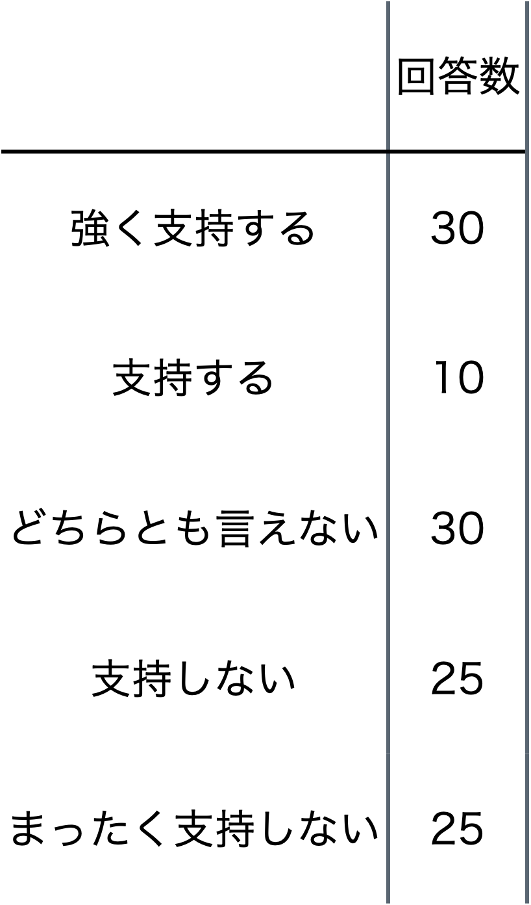
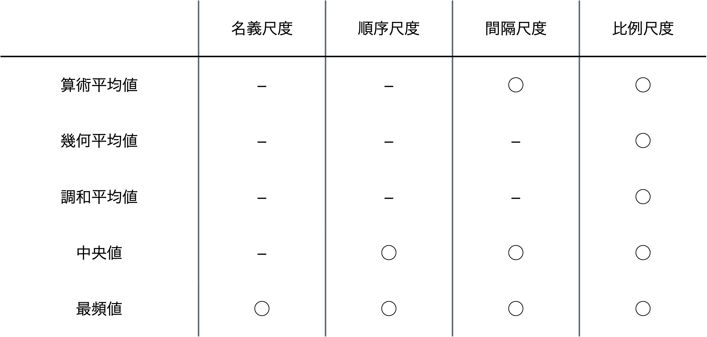

## 要約統計量

データの分布はそのデータの持つ傾向や特徴を探る重要な手がかりとなります．要約統計量はこのデータの分布を概括して表現してくれる数値です．要約統計量からはデータの分布の中心的位置や散らばり具合，形状を知ることができます．よって，与えられたデータの要約統計量を把握することはデータの全体像をイメージするヒントとなります．ただし，データの尺度水準により可能な数学的操作が異なるため適用できる要約統計量もデータの尺度水準に依存します．

### 分布の中心

要約統計量のうちデータの分布の中心的位置を表す統計量には平均値，中央値，最頻値があります．データの分布の中心的位置を表す統計量は__代表値__とも呼ばれます．

- 平均値
多くの場合，平均値と言えば算術平均値（相加平均値）を指しますが，算術平均値ではなく幾何平均値（相乗平均値）や調和平均値などが平均値として扱われる場合もあります．この本でも本節以外では断りがない限り平均値は算術平均値を指すものとしています．

__算術平均値（相加平均値）__: 要素数が_n_個のデータ($a_1$, ･･･, $ a_n$)の算術平均値_A_は以下の式で求められます．
$$
\mathbf{\textit{A}} = \frac{a_1 + a2 + ･･･　＋ a_n}{n} = \frac{1}{n} \sum_{i = 1}^n a_i
$$

算術平均値はデータの要素すべてを足し合わせた値をデータの要素数で割った値です．足し算を行うので間隔尺度以上のデータに対して意味を持ちます．

算術平均値は数学や物理学，工学などの理系分野だけではなく言語学や経済学，社会学などの文系分野でも広く利用されています．

__幾何平均値（相乗平均値）__: 要素数が_n_個のデータ{$$a_{1}, ･･･, a_{n}$$}の幾何平均値_G_は以下の式で求められます．

$$
\mathbf{\textit{G}} = \sqrt[n]{a_1 \times a2 \times ･･･　\times a_n} = \left( \prod_{i = 1}^n a_i \right)^\frac{1}{n}
$$

幾何平均値はデータの要素すべてを掛け合わせた値のn乗根[^10]です．掛け算を行うので比例尺度以上のデータに対して意味を持ちます．また，データはすべて正の数である必要があります．

幾何平均値はデータの要素同士の掛け算が有益なデータの代表値として採用されます．応用例として比率の平均値を挙げることができます．

日本の移動通信の2011年から2020年の各年3月の月間平均アップロードトラフィックの推移は(9.9Gbps, 23.4Gbps, 44.2Gbps, 80.0GBps, 123.3Gbps, 184.5, 249.0, 335.9, 404.6, 442.3Gbps)となっています[^11]．よって，月間平均アップロードトラフィックの前年度比は(2.36, 1.89, 1.81, 1.54, 1.50, 1.35, 1.35, 1.20, 1.09)となります．前年度比の算術平均値を_A_，幾何平均値を_G_とすると
$$
A = \frac{2.36 + 1.89 + 1.81 + 1.54 + 1.50 + 1.35 + 1.35 + 1.20 + 1.09}{9} = 1.565･･･
$$
$$
G = \sqrt[9]{2.36 \times 1.89 \times 1.81 \times 1.54 \times 1.50 \times 1.35 \times 1.35 \times 1.20 \times 1.09} = 1.524･･･
$$
となります．

「2011年から2020年までの前年度比の平均値は_M_である」とすれば，2011年から2020年までは毎年_M_の比率で月間平均アップロードトラフィックが増加または減少しているとして2011年の月間平均アップロードトラフィックの値$T_{2011}$から2020年の値$T_{2020}$を計算することができます．この時，_M_，$T_{2011}$，$T_{2020}$には以下の関係が成立します．
$$
T_{2020} = T_{2011} \times M^{(2020 - 2011)} = T_{2011} \times M^{9}
$$
2011年の月間平均アップロードトラフィックの実測値9.9を$T_{2011}$に代入し，_M_ = _A_および_M_ = _G_としてそれぞれ$T_{2020}$を計算すると，
$$
T_{2020} = 9.9 \times A^9 = 9.9 \times 1.565^9 = 557.5･･･ \\
T_{2020} = 9.9 \times G^9 = 9.9 \times 1.524^9 = 439.0･･･
$$
となります．

2020年の月間平均アップロードトラフィックの実測値は442.3なので算術平均値を前年度比の平均値としてしまうと2020年の値を大きく見積もりすぎてしまいます．この場合の平均値は幾何平均値が妥当であることがわかります[^12]．

[^10]: xのn乗がyになるとき，xをｙのn乗根と言います
[^11]: [我が国の移動通信トラヒックの現状](https://www.soumu.go.jp/johotsusintokei/field/data/gt010602.xlsx)

[^12]: 元データの値442.3Gbpsと一致していない理由は前年度比の数値やGの値を丸めて計算しているためです．数値を丸めずに計算すれば元データの値と一致します．

__調和平均値__: 要素数が_n_個のデータ{$$a_{1}, ･･･, a_{n}$$}の調和平均値_H_は以下の式で求められます．
$$
\mathbf{\textit{H}} = \frac{n}{\frac{1}{a_1} + \frac{1}{a_2} + ･･･ + \frac{1}{a_n}} = \frac{n}{\sum_{i = 1}^n \frac{1}{x_i}}
$$
調和平均値はデータ要素の逆数の算術平均値の逆数です，データ要素の逆数を利用するので比例尺度以上のデータに対して意味を持ちます．また，データはすべて正の数である必要があります．

調和平均値は幾何平均値と同様，比率の平均値として採用されます．応用例として速度の平均値を挙げることができます．

東京ー福岡900㎞を最初の300㎞は時速60㎞ / hで，次の300㎞は時速120㎞ / hで，最後の300㎞は時速150㎞ / hで移動したとします．300㎞ずつを時速60㎞ / h，時速120㎞ / h，時速150㎞ / hで移動するので東京から福岡までの移動時間を_T_とすると
$$
T = \frac{300}{60} + \frac{300}{120} + \frac{300}{150} = 9.5
$$
となります．また，移動速度の算術平均値を_A_，調和平均値を_H_とすると
$$
A = \frac{60 + 120 + 150}{3} = 110 \\
H = \frac{3}{\frac{1}{60} + \frac{1}{120} + \frac{1}{150}} = 94.73･･･
$$
となります．

「東京から福岡までの移動速度の平均値は_M_である」とすれば，東京から福岡までは速度_M_で移動し続けたとして東京から福岡までの移動時間_T_を計算することができます．この時，_M_ ，_T_には以下の関係が成立します．
$$
T = \frac{900}{M}
$$
$M = A$および$M = H$としてそれぞれ_T_を計算すると
$$
T = \frac{900}{A} = \frac{900}{110} = 8.18･･･ \\
T = \frac{900}{H} = \frac{900}{94.73･･･} = 9.5
$$
となります．東京から福岡までの移動時間は9.5時間なので算術平均値を速度の平均値としてしまうと誤った数値を導いてしまいます．この場合の平均値は調和平均値が妥当であることがわかります．

算術平均値，幾何平均値，調和平均値のいずれの計算にもすべてのデータが使われます．これは平均値にはすべてのデータが影響を及ぼしていると言うことであり，分布の全体像を概括するという要約統計量として優れている点だと言えます．

一方で，すべてのデータを利用しているが為に，データに他の値とは大きく異なる値である外れ値が含まれていると，平均値はその影響を大きく受けます．

外れ値の影響を確かめてみます．データ$X_0 = (55, 56, 57, 58, 59, 60)$の算術平均値_A_，幾何平均値_G_，調和平均値_H_は以下の様になります．
$$
A = 57.5, G = 57.47･･･, H = 57.44･･･
$$
データ$X_0$に外れ値として10が含まれたデータ$X_1 = (10, 55, 56, 57, 58, 59, 60)$の_A_，_G_，_H_は以下の様になります．
$$
A = 50.71･･･, G = 44.76･･･, H = 34.23･･･
$$
外れ値が1つ含まれただけでデータ$X_1$の3種類の平均値はいずれもデータ$X_0$の区間[55, 60]には含まれない値となっています．これは平均値が外れ値に対して頑健ではないことを示しています．

また，平均的とは「その同類全体の中で最も一般的であるさま．普通程度であるさま．」[^13]を意味しますが，データの分布に偏りがあると平均値は平均的な値とはなりません．

左の図は「平成28年 国民生活基礎調査の概況」（厚生労働省）[^14]に掲載されている各種世帯の貯蓄額階級別世帯数の割合の表をベースに仮想的に作成した貯蓄額毎の世帯数の分布をグラフにしたものです．データの分布に偏りがあります．このデータから計算される貯蓄額の平均値[^15]は1,085万円となりますが，この貯蓄額が平均的であると言うことには無理がありそうです．

右の図は左右対称になるように作成した貯蓄額毎の世帯数の分布をグラフにしたものです．このデータから計算される平均値は3,564万円となります．偏りがある分布とは異なり，単峰性[^16]で偏りのない分布では平均値が平均的な値であることがわかります．

[^13]: [三省堂大辞林第三版](https://www.weblio.jp/content/平均的)
[^14]: [「平成28年 国民生活基礎調査の概況」（厚生労働省）](https://www.mhlw.go.jp/toukei/saikin/hw/k-tyosa/k-tyosa16/dl/16.pdf)
[^15]: ここでの平均値は算術平均値です．貯蓄額が0の世帯もデータに含まれるため幾何平均値や調和平均値は計算できません．
[^16]: 単峰性の分布とはピークが1つの分布のことです．

ここで見たように，外れ値が含まれるデータや分布に偏りのあるデータの平均値は代表値としては適切ではない場合があるので注意が必要です．

- 中央値

中央値とはデータを昇順あるいは降順に並べた時，中央になる値です．データの要素数が無限の場合，中央値は存在しません．

データの要素数を_N_，データを昇順に並べた時の_i_番目の要素を$a_{i}$とすると中央値_Med_は以下の式で求められます．
$$
Med = \left\{
				\begin{array}{}
					a_{\frac{N + 1}{2}} （N: 奇数） \\
					\frac{a_{\frac{N}{2}} + a_{\frac{N}{2} + 1}}{2} （N: 偶数）
				\end{array}
			\right.
$$
データの要素数が奇数の時はデータを昇順に並べた時の中央の要素の値，データの要素数が偶数の場合はデータを昇順に並べた時の中央に近い2つの要素の値の算術平均値となります．データを昇順に並べるためデータの要素間で大小の評価が必要となります．よって，中央値は順序尺度以上のデータに対して意味を持ちます．

上の中央値を求める式からも判るように，中央値は中央の1つの要素あるいは中央に近い2つの要素のみから影響を受けます．そのため平均値に比べ中央値は外れ値の影響を受けにくい代表値となっています．

先に平均値における外れ値の影響を確かめた際に使ったデータ$X_{0}$とデータ$X_{1}$についてそれぞれの中央値を$Med_{0}$，$Med_{1}$とすると
$$
Med_{0} = \frac{57 + 58}{2} = 57.5 \\
Med_{1} = 57
$$
となります．中央値は平均値と比べ外れ値の影響が少なく，外れ値に対して頑強であることが判ります．

一方で，1つあるいは2つの要素の値という限られた値のみを利用しているため，データ全体の変化を中央値では捉えられないこともあります．

ある企業の部署毎の売り上げを昇順にしたデータが前年度は(10億円, 15億円, 30億円, 35億円, 40億円)で今年度は(15億円, 20億円, 25億円, 45億円, 50億円)だったとします．前年度の売上総額を$S_{0}$，算術平均値を$A_{0}$，中央値を$Med_{0}$，今年度の売上総額を$S_{1}$，算術平均値を$A_{1}$，中央値を$Med_{1}$とすると，
$$
S_{0} = 130, A_{0} = 26, Med_{0} = 30 \\
S_{1} = 155, A_{1} = 31, Med_{1} = 25
$$
となります．前年度に比べ今年度の売上総額および算術平均値は増えていますが[^17]，中央値だけは減っています．中央値の変化だけを見ていると前年度に比べ今年度の売り上げが約1.2倍に伸びたことに気づかないだけではなく，逆に業績が悪化したと判断してしまいかねません．

データのうち1つまたは2つの要素の値しか反映しないという中央値の特徴が弱みとなった例です．

[^17]: 幾何平均値も調和平均値も前年度に比べ今年度の値は大きくなります

- 最頻値

最頻値とはデータの中で出現する回数が最も多い値です．値同士の区別ができればその値の出現回数を数えることができるので，最頻値を求めるために算術計算や大小評価をする必要はありません．従って，最頻値はすべての尺度水準のデータに対して意味を持ちます．

最頻値は名義尺度のデータに対しては唯一の有効な代表値となります．日本国内に住民票のある居住者全員の住所の都道府県名のデータは(北海道 , 東京, 東京, 大阪, ･･･)と言うようになります．このデータは名義尺度であるため算術計算をすることができず平均値を求めることができません．また，大小の評価をすることもできないので中央値を求めることもできません．しかし，「北海道と東京は別の値である」と区別をすることはできるためデータの中で最も出現回数の多い値が「東京」であると決定することができ，最頻値は求めることができます．

最頻値は最も出現回数の多い値だけに依存して決定されます．また，外れ値の出現回数が他の値の出現回数よりも多く，外れ値が最頻値となることは非常に特殊なケースを除いてはありません[^18]．従って，最頻値は殆どの場合，外れ値の影響は受けず，外れ値に対して頑強であると言えます．

[^18]: データの要素数が極端に少ない場合には外れ値が最も多く出現するケースも皆無ではありません．

また，先に平均値におけるデータの分布の偏りの影響を確かめた貯蓄額毎の世帯数分布のように極端に分布に偏りのあるデータに対しては，最頻値が代表値として妥当である場合があります．

最頻値は一意に定まるとは限りません．ある政党に対する支持を問うたアンケートに対する120名の回答が以下の様だったとします．この場合，最頻値は「強く支持する」と「どちらとも言えない」の2つとなっています．

1つのデータに対して平均値や中央値が2つ以上存在すると言うことはありませんが，最頻値はこのように2つ以上存在することもあります．このことは最頻値の代表値としてのデメリットと言えます．

また，このアンケート結果から政党を支持しているのかあるいは支持していないのかをはっきりさせるため，「強く支持する」の回答数と「支持する」の回答数をまとめ，新たに「支持する」の回答数とし，「まったく支持しない」の回答数と「支持しない」の回答数をまとめ，新たに「支持しない」の回答数として結果をまとめ直すと以下の様になります．

まとめ直したアンケート結果の最頻値は「支持しない」となり，元のアンケート結果とは異なる印象を与えます．最頻値はデータの区切り方に大きく影響を受けることがわかります．このことも最頻値の代表値としてのデメリットと言えます．

適用可能な代表値と尺度水準の対応は以下の様になります．

平均値はデータが有している情報をすべて反映していますが，中央値や最頻値はデータが有している情報を切り捨てています．データが有している情報を反映している程度は平均値 > 中央値 > 最頻値​となっています．従って，原則的には代表値としては平均値を使うことが好ましいと言えます．

しかし，対象とするデータの尺度水準に適用可能な代表値でなければ，その代表値は意味を持ちません．また，ここで述べたように平均値，中央値，最頻値にはそれぞれメリット，デメリットがあります．データに対して代表値使う時には，これらを踏まえて使用することが重要です．

