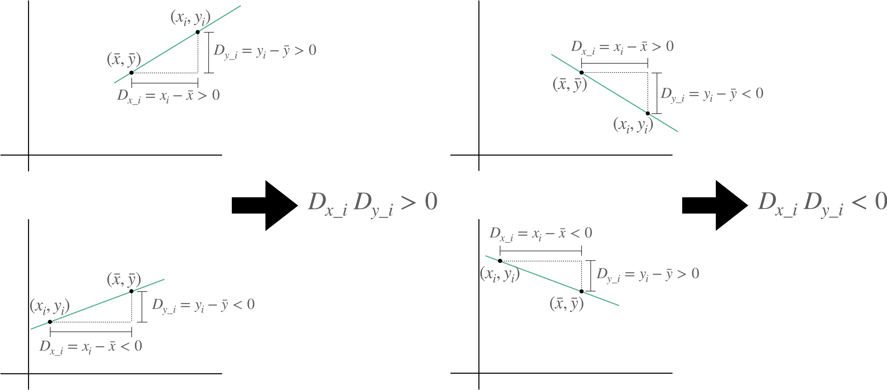

## 要約統計量

データの分布はそのデータの持つ傾向や特徴を探る重要な手がかりとなります．要約統計量はこのデータの分布を概括して表現してくれる数値です．要約統計量からはデータの分布の中心的位置や散らばり具合，形状を知ることができます．よって，与えられたデータの要約統計量を把握することはデータの全体像をイメージするヒントとなります．ただし，データの尺度水準により可能な数学的操作が異なるため適用できる要約統計量もデータの尺度水準に依存します．

### 分布の散らばり

要約統計量のうちデータの分布の散らばり具合を表す統計量には分散，標準偏差，範囲，四分位範囲などがあります．データの分布の散らばり具合を表すこれらの統計量は__散布度__とも呼ばれます．

- 分散

分散とはデータの分布が平均値に集中している程度により散らばり具合を指標化した数値です．具体的には__偏差__の二乗の平均値として定義されます．偏差とは平均値と要素の差のことです．

データ$(x_{1}, x_{2}, ･･･, x_{n})$の平均値を$\bar{x}$とすれば，$x_{i}$の偏差$D_{i}$は以下の式で求められます．
$$
D_{i} = x_{i} - \bar{x}
$$
偏差の絶対値が大きければそのデータ要素は平均値から離れていることになります．しかし，偏差の定義より全データ要素の偏差の総和は0となってしまいますので，偏差そのものではなく偏差を二乗します，偏差を二乗した値もそのデータ要素が平均値から離れているほど大きな値となります．この偏差の二乗の平均値として分散を定義します．

よって，それぞれのデータ要素が平均値から離れているほど分散は大きくなります．従って，分散は平均値への集中度合いを表す散布度となります．

要素数が_n_個のデータ($x_1$, ･･･, $ x_n$)からなる母集団の算術平均値を$\mu$とすると，この母集団の分散である$\sigma^2$は以下の式で求められます．
$$
\sigma^2 = \frac{1}{n} \sum_{i = 1}^n (x_i - \mu)^2
$$
要素数が_n_個のデータ($x_1$, ･･･, $ x_n$)からなる標本の算術平均値を$\bar{x}$とすると，この標本の分散である__標本分散__$s^2$は以下の式で求められます．
$$
s^2 = \frac{1}{n} \sum_{i = 1}^n (x_i - \bar{x})^2
$$
多くの場合，データ分析では母集団の性質を知ることが目的となりまが，母集団のデータをすべて入手できることは殆どありません．そのため，母分散$\sigma^2$も直接計算することはできません．しかし，標本から母分散$\sigma^2$を推定することができます．

この標本に基づき推定される母分散$\sigma^2$の推定量は__不偏分散__と呼ばれ，一般的に標本分散$s^2$よりも若干小さな値になることが知られています．

要素数が_n_個のデータ($x_1$, ･･･, $ x_n$)からなる標本の算術平均値を$\bar{x}$とすると，不偏分散$\hat{\sigma}^2$は以下の式で求められます[^19]．
$$
\hat{\sigma}^2 = \frac{1}{n - 1} \sum_{i = 1}^n (x_i - \bar{x})^2
$$
標本分散$s^2$と不偏分散$\hat{\sigma}^2$の計算式から判るように，データのサンプルサイズ_n_が大きいほど，標本分散$s^2$は不偏分散$\hat{\sigma}^2$に近づきます．

あるクラスを対象に数学のテストを実施し，全受験者の中からランダムに選んだ5名の点数が(60, 65, 70, 80, 90)だったとします．この5名の点数の算術平均値を$\bar{x}$，標本分散を$s^2$，今回のテストの点数の不偏分散$\hat{\sigma}^2$とすれば
$$
\bar{x} = \frac{60 + 65 + 70 + 80 + 90}{5} =  73 \\
s^2 = \frac{1}{5} \left \{ (60 - 73)^2 + (65 - 73)^2 + (70 - 73)^2 + (80 - 73)^2 + (90 - 73)^2\right \} = 116\\
\hat{\sigma}^2 = \frac{1}{5 - 1} \left \{ (60 - 73)^2 + (65 - 73)^2 + (70 - 73)^2 + (80 - 73)^2 + (90 - 73)^2\right \} = 145
$$
となります．

また，標本に基づき推定される推定量の期待値が母集団のそれに等しい時，この推定量は不偏推定量と呼ばれますが，不偏分散の期待値は母分散に一致するので分散の不偏推定量となっています．即ち，母集団から標本抽出を_k_回行い，_i_回目の標本から計算される不偏分散を$\hat{\sigma}^2_i$とすると，
$$
\sigma^2 = \lim_{k \to \infty}(\frac{1}{k}\sum_{i = 1}^k \hat{\sigma}^2_{i})
$$
となります[^20]．

[^19]:不偏分散の計算式の妥当性は数学的に導くことができます．参考文献
[^20]: 不偏分散の期待値が母分散と一致することも数学的に導かれます．

データ分析では母分散や標本分散よりも頻繁に不偏分散を扱います，このためデータ分析において分散とは一般的に不偏分散を意味します．

- 標準偏差

標準偏差とは分散の正の平方根として計算される散布度です．データが母集団の時の標準偏差を__母標準偏差__，データが標本の時の標準偏差を__標本標準偏差__呼びます．

要素数が_n_個のデータ($x_1$, ･･･, $ x_n$)からなる母集団の算術平均値を$\mu$とすると，この母集団の母標準偏差$\sigma$は以下の式で求められます．
$$
\sigma = \sqrt{\sigma^2} = \sqrt{\frac{1}{n} \sum_{i = 1}^n (x_i - \mu)^2}
$$

要素数が_n_個のデータ($x_1$, ･･･, $ x_n$)からなる標本の算術平均値を$\bar{x}$とすると，この標本の標本標準偏差$s$は以下の式で求められます．
$$
s = \sqrt{s^2} = \sqrt{\frac{1}{n} \sum_{i = 1}^n (x_i - \bar{x})^2}
$$

母分散の不偏推定量である不偏分散$\hat{\sigma}^2$の平方根である$\hat{\sigma}$を不偏標準偏差と呼びます（呼ぶことがあります？）．$\hat{\sigma}$の期待値は母集団の標準偏差と等しいとは限らず，$\sigma$は母集団の標準偏差の不偏推定量ではありませんが，母集団の標準偏差の推定量として利用されます．
$$
\hat{\sigma} = \sqrt{\hat{\sigma}^2} = \sqrt{\frac{1}{n - 1} \sum_{i = 1}^n (x_i - \bar{x})^2}
$$
分散も標準偏差も平均値を基準にしたデータ分布の散らばり具合を表していますが，分散は平均値と単位が異なります．他方，標準偏差は平均値と単位が同じになります．例えば，㎝を単位として測定したデータの平均値と標準偏差の単位は㎝ですが，分散の単位は$cm^2$となります．

このため平均値と標準偏差は直接比較することができますが，平均値と分散を直接比較することは自然ではありません．データ分布を代表値と散布度で記述する場合も代表値が平均値の時は，散布度として分散でなく，標準偏差を採用することが一般的です．

- レンジ

レンジとはデータの存在している範囲によりデータの散らばり具合を指標化した数値です．データの要素の最大値が$x_{max}$，最小値が$x_{min}$である時，このデータのレンジ$R$は以下の式で求められます．
$$
R = x_{max} - x_{min}
$$
データに外れ値が含まれている場合，レンジは外れ値の影響を受けます．

データに外れ値が含まれていれば，（非常に特殊な場合を除き？）データの要素の最大値あるいは最小値のうち少なくともどちらかは外れ値です．よって，レンジは外れ値の影響を直接受けます．

先に平均値における外れ値の影響を確かめた際に使ったデータ$X_{0}$とデータ$X_{1}$についてそれぞれのレンジを$R_{0}$，$R_{1}$とすると
$$
R_{0} = 60 - 55 = 5 \\
R_{1} = 60 - 10 = 50
$$
となります．レンジが外れ値の影響を受けることが確認できます．

レンジはデータの要素の最大値と最小値の2つの値により決定され，この2つの値以外からは一切影響を受けません．よって，サンプルサイズが変化してもレンジに対する外れ値の影響は変化しません．一方，データのサンプルサイズが計算式に含まれる分散や標準偏差はサンプルサイズが大きくなると外れ値の影響は小さくなります．

このため，レンジは分散や標準偏差よりも外れ値に対して敏感です．

- 四分位範囲

四分位範囲とはレンジと同様，データの存在している範囲によりデータの散らばり具合を指標化した数値です．レンジは全データの存在する範囲として最大値と最小値から求められますが，四分位範囲はデータの中央部の約50%が存在する範囲として四分位数を使って求められます．

四分位数とはデータを昇順に並べ4等分にした時，その4等分した位置にある値のことです．小さい方から第1四分位数，第2四分位数，第3四分位数と言います．第2四分位数は中央値と等しくなります．

第1四分位数を$Q_{1}$，第3四分位数を$Q_{3}$とすると四分位範囲$IQR$は以下の式で求められます．
$$
IQR = Q_{3} - Q_{1}
$$
データに外れ値が含まれていれば，外れ値は（非常に特殊な場合を除き？）最小値から第1四分位数の間または第3四分位数から最大値の間に存在しています．しかし，（レンジは最大値と最小値を使って求められましたが，？）四分位範囲は最小値から第1四分位数までのデータと第3四分位数から最大値までのデータを切り捨てて求められます．従って，四分位範囲は外れ値に対して頑強です．

先に平均値における外れ値の影響を確かめた際に使ったデータ$X_{0}$とデータ$X_{1}$についてそれぞれの第1四分位数を$Q_{1\_0}$，$Q_{1\_1}$，第3四分位数を$Q_{3\_0}$，$Q_{3\_1}$，四分位範囲を$IQR_{0}$，$IQR_{1}$とすると
$$
Q_{1\_0} = 56, Q_{3\_0} = 59 \\
IQR_{0} = Q_{3\_0} - Q_{1\_0} = 59 - 56 = 3 \\
Q_{1\_1} = 55, Q_{3\_1} = 59 \\
IQR_{1} = Q_{3\_1} - Q_{1\_1} = 59 - 55 = 4
$$
となります．四分位範囲がレンジとは異なり，外れ値に対して頑強であることが確認できます．

データ分布を代表値と散布度で記述する場合に代表値を中央値とした時は散布度として標準偏差ではなく四分位範囲を採用することが一般的です．標準偏差は平均値に対してのデータの散らばりを指標化した散布度なので，中央値とペアで使うことが不自然なためです．

四分位数の具体的な求め方については複数の手法が提唱されいますが[^21]，どの手法が最も優れているかについては合意が形成されていません．以下では中央値を利用した四分位数の求め方について説明します．

1. データを昇順に並べ中央値を求めます．この中央値が第2四分位数$Q_{2}$となります．
2. データを$Q_{2}$より小さい部分と大きい部分に分けます．
3. 小さい部分の中央値を第1四分位数$Q_{1}$，大きい部分の中央値を第3四分位数$Q_{3}$とします．

先程の四分位範囲における外れ値の影響を確かめた例ではこの手法で第1四分位数および第3四分位数を求めています．

[^21]: [Quartile](https://en.wikipedia.org/wiki/Quartile)

散布度は間隔尺度以上のデータに対して意味を持ちます．

### 分布の形状

要約統計量のうちデータの分布の形状を表す統計量には歪度，尖度があります．

- 歪度

歪度とは分布の歪み具合を指標化した統計量です．要素数が_n_個のデータ($x_1$, ･･･, $ x_n$)からなる標本の算術平均値を$\bar{x}$，不偏標準偏差を$\hat{\sigma}$とすると，母集団の歪度の推定量$b_{1}$は以下の式で求められます．ただし，$b_{1}$は不偏推定量ではありません．
$$
b_{1} = \frac{m_{3}}{\hat{\sigma}^3} \\
ただし，m_{3} = \frac{1}{n} \sum_{i = 1}^n \left (x_{i} - \bar{x}\right)^3 とする
$$

歪度が正となる時，分布は右に裾の長い形状となります．歪度が負となる時，分布は左に裾の長い形状となります．

- 尖度

尖度とは分布の裾の重さを指標化した統計量です．要素数が_n_個のデータ($x_1$, ･･･, $ x_n$)からなる標本の算術平均値を$\bar{x}$，不偏標準偏差を$\hat{\sigma}$とすると，母集団の尖度の推定量$b_{2}$は以下の式で求められます．ただし，$b_{2}$は不偏推定量ではありません．
$$
b_{2} = \frac{m_{4}}{\hat{\sigma}^4} \\
ただし，m_{4} = \frac{1}{n} \sum_{i = 1}^n \left (x_{i} - \bar{x}\right)^4 とする
$$
尖度$b_{2}$はデータ分布が正規分布[^22]に従う時，$b_2 = 3$となるので，正規分布を基準とした評価を行いたい時には以下の式で与えられる$g_{2}$​を尖度として使います．$g_{2}$は過剰尖度と呼ばれます．
$$
g_{2} = b_{2} - 3
$$
過剰尖度が正となる時，分布の裾は正規分布の裾よりも軽くなります．過剰尖度が負となる時，分布の裾は正規分布の裾よりも軽くなります．分布が正規分布に従う時は過剰尖度は0になります．

上図では青色の曲線が正規分布です．過剰尖度を調べることで極端な値を取るデータの割合が，正規分布と比べて大きいかを判断することができます．

歪度および尖度は間隔尺度以上のデータに対して意味を持ちます．

[^22]: 正規分布は社会科学分野でも自然科学分野でも頻繁に用いられる確率分布です．詳細は◯章◯節参照．

## 関係を捉える

変数間の関係を調べることは，データ分析の大きな目的です． 変数間の関係の表現方法は，その変数がどの尺度水準なのかによって変わってきます．

### 分割表

分割表とは，質的変数[^footnote_ qualitative_V]間の関係を分析する際に，その前段階として作成される変数間の関係を集計した表のことです．$n$個の変数を対象とすれば$n$次元の分割表が作成されます．

[^footnote_ qualitative_V]: 名義尺度の変数および順序尺度の変数．

3次元以上は紙面（平面?）での表現が困難なため，ここでは2つの変数を対象とした2次元分割表について説明します．

関心のある2つの変数のうち，一方の変数の実現値を行名，もう一方の変数の実現値を列名にします．行に対応させた変数$A$の実現値が$(A_1, A_2, ･･･, A_r)$の$r$種類，列に対応させた変数$B$の実現値が$(B_1, B_2, ･･･, B_s)$の$s$種類ならば分割表は以下の様に$(r + 1)$行$ \times (s + 1)$列なります．この表は$r \times s$分割表と呼ばれます．

$i$行$j$列のセルには，変数$A$の実現値が$A_i$で変数$B$の実現値が$B_j$となっているサンプルの出現回数を記入します．最下行には各列の合計値を，最右行には各行の合計値を記入します．表の右下に記入される数値はデータのサンプルサイズとなっています．

仮に想定したある大学の今年度の学部卒業生のデータを例にして．分割表の作成の仕方を見てみます．

このデータから卒業学部と進路を変数とした分割表は以下の手順で作成します．

1. データ中に現れる学部の実現値と進路の実現値を抽出します．今回は学部の実現値が(理学部, 工学部, 経済学部, 文学部)の4種類​，​進路の実現値が(進学, 就職, 不明)の3種類たったとします．
2. $5 \times 4$の表を作成し行名を「理学部」，「工学部」，「経済学部」，「文学部」，列名を「進学」，「就職」，「不明」とします．
3. 行名と列名のクロスしたセルには，データからその行名と列名の組み合わせに該当する卒業者をカウントし，その数を記入します．学部が理学部で進路が就職となっているサンプルが80件であれば，セル［理学部 - 就職］には80と記入します．
4. 最下行には列ごとの合計値を，最右行には行ごとの合計値を記入します．

手作業での分割表の作成はかなり大変な作業となりますが，RやPythonであれば1つの関数で作成することもできます．

この分割表から理系学部における進学の割合と文系学部における進学の割合には差がありそうだと言うことがわかりますが，実際に学部の違いが進学の割合に影響を与えているかを客観的に判断するためには検定をする必要があります[^23]．

[^23]: $\chi^2$検定（カイ二乗検定）など．◯章◯節

分割表はずべての尺度水準のデータに対して適用することができますが，間隔尺度以上のデータである量的変数に対して分割表を利用することは一般的には行われません．分割表を作成するためにはデータを質的変数に変換する必要があり，そのことにより量的変数としての情報を損なうことになるからです．

### 相関係数

相関係数とは2つの変数間の比例的性質の強さを指標化した数値です．相関係数は-1以上1以下の値を取り，その絶対値が小さければ変数間の比例的性質が弱いことを，その絶対値が大きければ比例的性質が強いことを示します．

相関係数には幾つかの種類があり，対象とする変数の尺度の組み合わせや仮定される変数の分布によって使い分けられます．

ここではピアソンの積率相関係数について説明します．一般的に相関係数という場合は，このピアソンの積率相関係数を指します．

変数$X(x_{1}, x_{2}, ･･･, x_{n})$と変数$Y(y_{1}, y_{2}, ･･･, y_{n})$がペアになったデータ$\{(x_{1}, y_{1}), (x_{2}, y_{2}), ･･･, (x_{n}, y_{n}) \}$のピアソンの積率相関係数$r$は，変数$X$の平均値を$\bar{x}$，$Y$の平均値を$\bar{y}$とすると以下の式で求められます．
$$
r = \frac{\sum_{i = 1}^n (x_{i} - \bar{x})(y_{i} - \bar{y})}{\sqrt{\sum_{i = 1}^n (x_{i} - \bar{x})^2}\sqrt{\sum_{i = 1}^n (y_{i} - \bar{y})^2}}
$$
なぜ，この式で求められる数値が比例的性質の強さの指標になるのかについて見てみます．

この式の分子と分母，それぞれに$\frac{1}{n}$を掛けると
$$
r = \frac{\frac{1}{n} \sum_{i = 1}^n (x_{i} - \bar{x})(y_{i} - \bar{y})}{\sqrt{\frac{1}{n} \sum_{i = 1}^n (x_{i} - \bar{x})^2}\sqrt{\frac{1}{n} \sum_{i = 1}^n (y_{i} - \bar{y})^2}}
$$

と変形できます．

変数$X$の標準偏差を$s_{x}$，$x_{i}$の偏差を$D_{x\_i}$，変数$Y$の標準偏差を$s_{y}$，$y_{i}$の偏差を$D_{y\_i}$とすれば，
$$
r = \frac{\frac{1}{n} \sum_{i = 1}^n D_{x\_i}D_{y\_i}}{s_{x} s_{y}} 
$$
となります．

この式の分子は変数$X$の偏差と変数$Y$の偏差の掛け算の平均となっています．この平均のことを共分散と呼びます．

いま，変数$X$と変数$Y$の共分散を$s_{xy}$とすると，
$$
s_{xy} = \frac{1}{n} \sum_{i = 1}^n D_{x\_i}D_{y\_i} \\
r = \frac{s_{xy}}{s_{x} s_{y}}
$$
です．

$D_{x\_i}$と$D_{y\_i}$が同符号となる$(x_{i}, y_{i})$のペアでは$D_{x\_i} D_{y\_i} > 0$となります．一方，$D_{x\_i}$と$D_{y\_i}$の符号が異なる$(x_{i}, y_{i})$のペアでは$D_{x\_i} D_{y\_i} < 0$となります．

図からわかるように，$D_{x\_i} D_{y\_i} > 0$となるような点$(x_{i}, y_{i})$は平均$(\bar{x}, \bar{y})$に対して右上がりの直線上にあります．$D_{x\_i} D_{y\_i} < 0$となるような点$(x_{i}, y_{i})$は平均$(\bar{x}, \bar{y})$に対して右下がりの直線上にあります．よって，平均に対して右上がりの直線上にある点が多くなるようなデータでは$s_{xy}> 0 $となり，平均に対して右下がりの直線上にある点が多くなるようなデータでは$s_{xy} <0$なり，これらの点が入り交じったデータでは$s_{xy}$は0に近い値となります．

つまり，2つの変数間には共分散が，正であれば正の比例的性質が強く，負であれば負の比例的性質が強く，0に近い値であればどちらでもないことがわかります．

しかし，共分散は2変数間の比例的性質の強弱だければなく，データのスケールからも影響を受けてしまいます．

2019年度の小学生男子の平均身長のデータ[^footnote_height]です．

[^footnte_height]: [学校保健統計調査令和元年度全国表「年齢別　設置者別　身長・体重の平均値及び標準偏差」](https://www.e-stat.go.jp/stat-search/files?page=1&layout=datalist&toukei=00400002&tstat=000001011648&cycle=0&tclass1=000001138504&tclass2=000001138505)を基に作成．

このデータの，身長の単位をセンチメートルとしたときの年齢と身長の共分散を$s_{xy\_C}$，身長の平均値を$\bar{y_{\_C}}$，身長の単位をインチしたときのそれらを$s_{xy\_I}$，$\bar{y_{\_I}}$とし，年齢平均値を$\bar{x}$とすれば，
$$
\bar{x} = 8.5, \; \bar{y_{\_C}} = 130.8･･･,  \; \bar{y_{\_I}} = 51.50･･･ なので\\
s_{xy\_C} = \frac{1}{6}\left \{ (6 - 8.5)(116.5 - 130.8･･･) + (7 - 8.5)(122.6 - 130.8･･･) + (8 - 8.5)(128.1 - 130.8･･･) \\ + (9 - 8.5)(133.5 - 130.8･･･) + (10 - 8.5)(139.0 - 130.8･･･) + (11 - 8.5)(145.2 - 130.8･･･) \right \} \\= 16.50･･･ \\ \\
s_{xy\_I} = \frac{1}{6}\left \{ (6 - 8.5)(45.86･･･ - 51.50･･･) + (7 - 8.5)(48.26･･･ - 51.50･･･) + (8 - 8.5)(50.43･･･ - 51.50･･･) \\ + (9 - 8.5)(52.55･･･ - 51.50･･･) + (10 - 8.5)(54.70 - 51.50･･･) + (11 - 8.5)(57.16･･･ - 51.50･･･) \right \} \\ = 6.499･･･ \\
$$
となります．

センチメートルを単位としたときもインチを単位としたときも共分散は正の値となるので，どちらの単位であっても年齢が増えるほど身長が高くなると言う正の比例関係は共分散から知ることができます．しかし，単位が違うだけで同一のデータの年齢と身長の関係性を表す数値が異なってしまうことは不都合です．

相関係数は共分散を変数の標準偏差で割ることにより，共分散の2変数間の比例的性質の強弱を反映しているという特長を活かしつつ，データのスケールからの影響は受けない指標となっています．

変数$X$と変数$Y$の相関係数を$r_{xy}$，共分散を$s_{xy}$，変数$X$と変数$Z$のそれらを$r_{xz}$，$S_{xz}$，変数$X$，変数$Y$，変数$Z$それぞれの平均値を$\bar{x}$，$\bar{y}$，$\bar{z}$，変数$X$，変数$Y$，変数$Z$それぞれの標準偏差を$s_{x}$，$s_{y}$，$s_{z}$とします．

また，変数$Z$は変数$Y$の単位を変換したデータであり
$$
Z = pY + q
$$
とします．ただし，$p$および$q$は定数です[^foornote_scale_conversion]．

[^foornote_scale_conversion]: センチメートルからインチへの変換であれば$(p, q) = (0.393701, 0)$，摂氏から華氏への変換であれば$(p, q) = (1.8, 32)$となります．

このとき
$$
\bar{z} = \frac{1}{n}\sum_{i = 1}^n z_{i} = \frac{1}{n}\sum_{i = 1}^n (py_{i} + q) 
= \frac{p}{n}\sum_{i = 1}^n y_{i} + q  = p\bar{y} + q 
$$
となるので
$$
s_{xz} = \frac{1}{n}\sum_{i = 1}^n (x_i - \bar{x})(z_{i} - \bar{z}) = 
\frac{1}{n}\sum_{i = 1}^n (x_i - \bar{x})\left\{(py_{i} + q) - (p\bar{y} + q)\right \} 
= \frac{p}{n}\sum_{i = 1}^n (x_i - \bar{x})(y_{i} - \bar{y}) \\
$$
よって，
$$
s_{xz} = p \left \{ \frac{1}{n}\sum_{i = 1}^n (x_i - \bar{x})(y_{i} - \bar{y}) \right \} = p s_{xy} \\
$$
また，
$$
s_{z} = \sqrt{\frac{1}{n}\sum_{i = 1}^n (z_{i} - \bar{z})^2} 
= \sqrt{\frac{1}{n}\sum_{i = 1}^n  \left \{ (py_{i} + q) - (p\bar{y} + q) \right \}^2}
= p \sqrt{\frac{1}{n} \sum_{i = 1}^n (y_{i} - \bar{y})^2} = ps_y \\
$$
以上より，
$$
r_{xz} = \frac{s_{xz}}{s_{x}s_{y}} = \frac{ps_{xy}}{s_xps_{y}} 
= \frac{s_{xy}}{s_{x}s_{y}} = r_{xy}
$$
となり，単位を変換しても相関係数は変わらないことが証明されます．

先の年齢と身長のデータで確かめてみます．年齢の標準偏差を$s_{x}$，単位をセンチメートルとしたときの相関係数を$r_{\_C}$，共分散を$s_{xy\_C}$，身長の標準偏差を$s_{y\_C}$，単位をインチにしたときのそれらを$r_I$，$s_{xy\_I}$，$s_{y\_I}$とすれば，
$$
s_x = 1.707･･･\\
s_{xy\_C} = 16.50･･･, \ s_{y\_C} = 9.668･･･, \ s_{xy\_I} = 6.499･･･, \ s_{y\_I} = 3.806･･･
$$
なので
$$
r_{C} = \frac{s_{xy\_C}}{s_x s_{y\_C}} = \frac{16.50･･･}{1.707･･･ \times 9.668･･･} = 0.9997･･･ \\
r_{I} = \frac{s_{xy\_I}}{s_x s_{y\_I}} = \frac{6.499･･･}{1.707･･･ \times 3.806･･･} = 0.9997･･･ \\
$$

となり，相関係数は変数の単位の変換に対して不変であることが確かめられました．このように単位を変換に対して不変である性質を__スケール不変姓__と言います．

相関係数$r$はこれまでに触れた

- 2つの変数間の比例的性質の強さを表す．
- スケール不変性を有している．

以外にも以下の特徴を備えています．

- $-1 \leqq r \leqq 1$である．
- $r = 1$となるのは1本の右上がりの直線上にすべてのデータ$(x, y)$が存在しているときである．
- $r = -1$となるのは1本の右下がりの直線上にすべてのデータ$(x, y)$が存在しているときである．
- 2変数間にまったく関係が無ければ$r = 0$となる．

相関係数$r$の値とデータの比例的性質の関係をグラフで確認してみます．

データが直線上に並んでいると相関係数の絶対値が1に近く，2変数間に関係がなさそうなデータでは相関係数が0に近いことがわかります．

しかし，「2つの変数間の比例的性質が強いと相関係数の絶対値は1に近くなる」とは言えますが，「相関係数の絶対値が1に近けれ2つの変数間の比例的性質は強い」とは言えません．

下の図は上の図で$r = -0.104$となっているデータに外れ値を1つ追加したデータのグラフです．$r = 0.726$となっており相関係数が外れ値に対して頑強ではなく，2つの変数間に比例的性質が殆どなくとも相関係数の絶対値が大きくなることはあり得ることがわかります．

また，「2つの変数間に関係がないとき相関係数は0に近い値となる」とは言えますが，「相関係数が0に近ければ2つの変数間には関係がない」とは言えません．

このグラフのデータは放物線上に並んでおり2つの変数間には関係がありますが$r = 0.052$となっており，相関係数はほぼ0です．これは相関係数が捉える変数間の関係性が比例的性質，つまり線形性であるためです．相関係数では線形ではない関係性は表現することができません．

相関係数は2変数間の関係を反映する指標ですが，データの分布を考慮せずに相関係数だけで変数間の関係性を判断することは危険です．

また，相関係数は順位尺度なので相関係数同士を比べるときはその大小だけが意味を持ちます．一方の相関係数が他方の相関係数の何倍であるかは意味がありません．

### 相関と因果

（相関係数で表現される線形の関係に限らず，一方の変数の変化に伴う他方の変数の変化に何らかの規則性がある時，これらの変数間には相関関係があると言います．?）

相関係数の絶対値が大きければ，一方の変数の増加に伴い他方の変数は増加あるいは減少します．この時，変数間には__相関関係__があると言います．

また，2つの事象で一方の事象が原因となり他方の事象がその結果として起こる場合，これらの事象間には__因果関係__があると言います．

変数間に相関関係が見出される場合，一方の変数の変化が原因となり他方の変数の変化はその結果である，即ち，互いの変数が変化したと言う事象間には因果関係があると考えたくなります．しかし，変数間に相関関係があるだけでは事象間に因果関係があると判断することはできません．

変数Xが変化する事象をA，変数Yが変化する事象をB，変数Zが変化する事象をCとします，XとYに相関関係が見られるのは，AとBには関係はないが偶然相関が生じているケースを除くと，以下の関係が考えられます．

1. AがBを発生させている
2. BがAを発生させている
3. CがAもBも発生させている
4. AとBは互いに原因と結果の関係にある

このうち，AとBが因果関係にあると言えるのは1.の関係と2.の関係みです．

3.の関係は__交絡__と呼ばれます．血圧[^footnote_bloodPressure]と平均給与[^footnote_salary]には正の相関がありますが，血圧が高いことで平均給与が高くなる，あるいは平均給与が高いことで血圧が高くなると言うことはありません．血圧と年収には因果関係はありません．それにもかかわらず血圧と平均給与に相関関係が見られるのは年齢という変数が血圧にも平均給与にも相関を持っているためです．

加齢に伴い血管壁の弾力性が失われるため年齢が高くなると血圧も高くなります．また，未だに日本では年功序列が多くであるため年齢が高くなると平均給与も高くなります．そのため．血圧が高いと平均給与も高くなるのです．

上図3.のXに血圧，Yに平均給与，Zに年齢，Aに血圧の変化，Bに平均給与の変化，Cに年齢の変化が該当します．

このような顕在化していない事象Cに関する変数Zは__交絡変数__と呼ばれ，事象Cの存在によって因果関係がない2つの変数XとYの間に見出される相関は__疑似相関__と呼ばれます．

4.の関係はフィードバックと呼ばれます．蒸気機関の遠心調速機では制御対象である回転数が高くなると遠心力を介してバルブが閉じる方向に動き蒸気出力が抑えられ，回転数が低くなります．回転数が低くなると錘の重力でバルブが開く方向に動き蒸気出力が上がり，回転数が高くなります．回転数の変化と蒸気出力の変化は互いが原因であり結果となっています．

上図4.のXに回転数，Yに蒸気出力，Aに回転数の変化，Bに蒸気出力の変化が該当します．

このような互いが原因であり結果となっている関係はフィードバックと呼ばれます．

相関関係が認められても，そこには因果関係は成立していないこともあります．誤った結論を導き出さないために，事象間の関係性の解釈は慎重に行う必要があります．

[^footnote_bloodPressure]: [平成30年国民健康・栄養調査](https://www.e-stat.go.jp/stat-search?page=1&query=血圧%E3%80%80%E3%80%80収縮期&sort=year_month%20desc&layout=dataset&metadata=1&data=1)

[^footnote_salary]: [民間給与実態統計調査 -調査結果報告- 国税庁長官官房企画課](https://www.nta.go.jp/publication/statistics/kokuzeicho/minkan2016/pdf/000.pdf)

